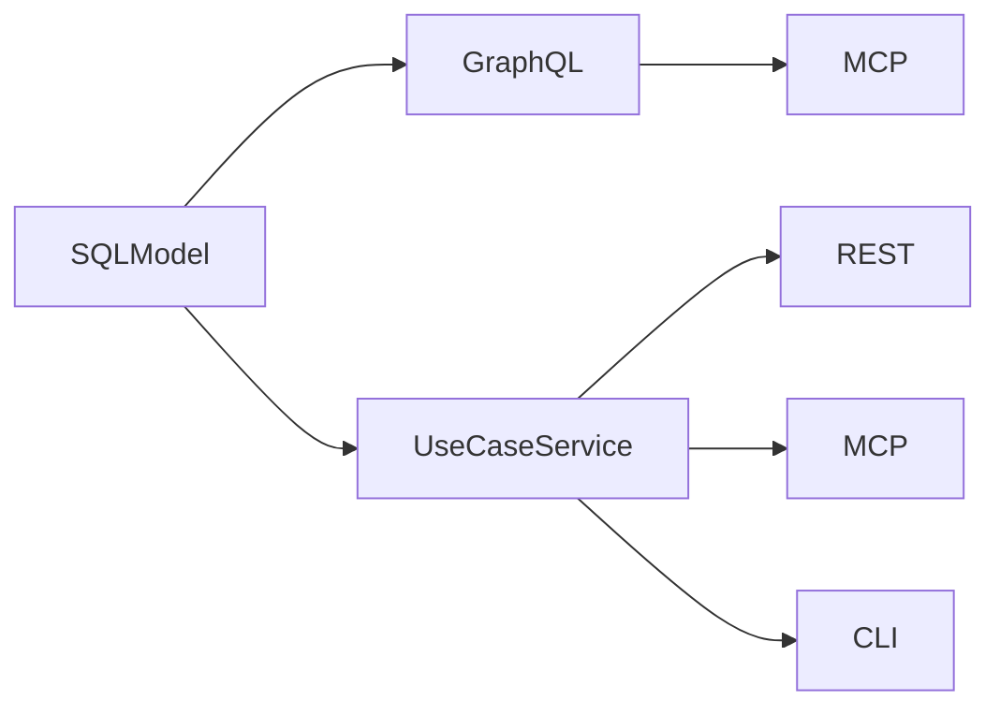

# nexusx

Write SQLModel classes. Get a complete API.

[](https://pypi.python.org/pypi/nexusx)
[](https://pepy.tech/projects/nexusx)

Define your entities once in SQLModel, and you get GraphQL, REST, and MCP — no repeated data models.



## Install

```bash
pip install nexusx
pip install nexusx[fastmcp]  # with MCP support
```

Requires Python ≥ 3.10.

## Quick Start

**Step 1 — Entities + GraphQL**

Define SQLModel entities and decorate entry-point methods with `@query`. `GraphQLHandler` walks the entity graph, generates SDL, and resolves relationships through DataLoader — one batched SQL per relationship level instead of N+1.

```python
from sqlmodel import SQLModel, Field, Relationship, select
from nexusx import query, mutation, GraphQLHandler

class User(SQLModel, table=True):
    id: int | None = Field(default=None, primary_key=True)
    name: str
    posts: list["Post"] = Relationship(back_populates="author")

    @query
    async def get_users(cls, limit: int = 10) -> list["User"]:
        async with get_session() as session:
            return (await session.exec(select(cls).limit(limit))).all()

class Post(SQLModel, table=True):
    id: int | None = Field(default=None, primary_key=True)
    title: str
    author_id: int = Field(foreign_key="user.id")
    author: User | None = Relationship(back_populates="posts")

handler = GraphQLHandler(base=SQLModel, session_factory=async_session)
```

`User.get_users` becomes a GraphQL query field. Querying `{ userGetUsers(limit: 5) { name posts { title } } }` triggers exactly two SQL round-trips — one for the users, one batched `SELECT ... WHERE author_id IN (...)` for all their posts. The handler is executor-only: mount it on any ASGI app via a POST route that calls `handler.execute(query=...)` (see [`demo/blog/app.py`](demo/blog/app.py) for a complete FastAPI example with GraphiQL). `handler.get_sdl()` returns the schema for codegen or external clients.

The [GraphQL mode guide](docs/guide/graphql_mode.md) covers filters, pagination (`enable_pagination=True` wraps lists in `Result { items, pagination }`), and `AutoQueryConfig` for auto-generated `by_id` / `by_filter` queries across every entity.

**Step 2 — Typed REST with DTOs**

GraphQL exposes entities directly. For REST handlers or service-layer code you usually want a smaller, intentional shape per endpoint — that's `DefineSubset`. Declare which fields to keep; relationship fields auto-load when their name matches an ORM relationship, so `author: UserDTO | None = None` populates itself from the underlying `author_id` FK without any loader boilerplate.

```python
from nexusx import DefineSubset, ErManager

class UserDTO(DefineSubset):
    __subset__ = (User, ("id", "name"))

class PostDTO(DefineSubset):
    __subset__ = (Post, ("id", "title", "author_id"))
    author: UserDTO | None = None  # auto-loaded — field name matches relationship

Resolver = ErManager(base=SQLModel, session_factory=async_session).create_resolver()
dtos = await Resolver().resolve(posts)
```

`posts` is whatever list of ORM instances you fetched — your query, your filter, your permissions. The Resolver traverses the DTO tree level-by-level, batching each level's loads the same way GraphQL does, and returns typed `PostDTO` instances with relationships filled in. Add `resolve_*` methods to override the auto-loader for a field, `post_*` methods for derived/computed fields. See the [Core API guide](docs/guide/core_api.md).

**Step 3 — MCP + REST from business logic**

For operations that compose multiple entities, apply permissions, or go beyond single-table CRUD, write a `UseCaseService` — a plain class whose `@query` / `@mutation` methods hold your business logic. One service class generates both an MCP server (4-layer progressive disclosure for AI agents) and FastAPI routes (one POST per method, types derived from signatures, OpenAPI docs included).

```python
from nexusx import UseCaseService, UseCaseAppConfig, create_use_case_graphql_mcp_server, create_use_case_router

class SprintService(UseCaseService):
    @query
    async def list_sprints(cls) -> list[SprintSummary]:
        """Get all sprints with task counts."""
        ...

config = UseCaseAppConfig(name="project", services=[SprintService])

# MCP for AI agents
mcp = create_use_case_graphql_mcp_server(apps=[config])
mcp.run()

# REST for frontend
app.include_router(create_use_case_router(config))
```

Methods are regular async functions — they can call `Resolver().resolve(...)` from Step 2 internally, so business logic and DTO assembly compose freely. Same Python class, three surfaces (MCP / REST / GraphQL-via-MCP). See [feature highlights](docs/feature-highlights.md) for the full picture.

## How It Compares

| | nexusx | Strawberry | FastAPI + SQLModel | FastMCP |
|---|:---:|:---:|:---:|:---:|
| GraphQL auto-gen | ✓ | ✓ | — | — |
| REST + OpenAPI | ✓ | — | ✓ (manual) | — |
| MCP | ✓ | — | — | ✓ |
| N+1 prevention | ✓ DataLoader | manual | — | — |
| Relationship auto-loading | ✓ implicit | manual | — | — |

## Demos

```bash
git clone https://github.com/allmonday/nexusx.git && cd nexusx && bash start_all.sh
```

| Port | Mode |
|-----:|------|
| 8000 | GraphQL playground |
| 8001 | Core API (REST + DTOs) |
| 8005 | Paginated GraphQL |
| 8006 | UseCase MCP (4-layer) |
| 8007 | UseCase FastAPI (REST) |
| 8008 | Voyager visualization |

## AI Agent Skill

A [4-phase skill](./skill/) guides AI coding agents: clarify requirements → build POC → add queries → productize.

```bash
ln -s $(pwd)/skill ~/.claude/skills/nexusx-4phase
```

## Development

```bash
./scripts/check-ci.sh       # lint + type-check + tests
uv run pytest               # tests only
uv run ruff check src/ tests/  # lint only
uv run mypy src/            # type-check only
```

## Documentation

- [API docs](docs/) — per-mode guides for GraphQL, Core API, and UseCase
- [Clean Architecture comparison](docs/clean-architecture-comparison.md)

## License

MIT
