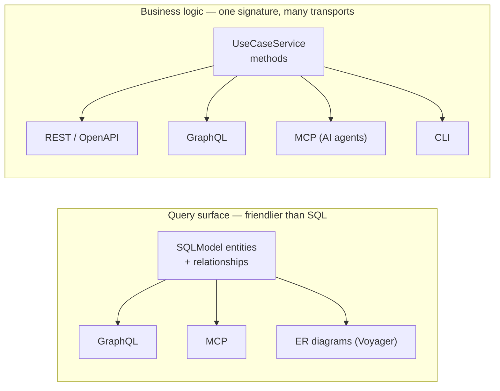

# nexusx

[](https://pypi.python.org/pypi/nexusx)
[](https://pepy.tech/projects/nexusx)

nexusx turns a SQLModel database into two things: a GraphQL **query interface**
that's friendlier than writing SQL, and **business logic** that ships as REST,
GraphQL, MCP, and CLI from a single signature.



## What it does for you

**1. A query interface over your database — not another query writer.**

`GraphQLHandler` reflects your entities and relationships into a read surface
where you declare the shape you want — `users { posts { comments } }` — and
nexusx compiles it to optimal SQL: one batched round-trip per level, columns
pruned to what you selected, per-parent pagination. N+1 and over-fetching
aren't pitfalls to avoid; they're structurally impossible. Turn on
`auto_query_config` for `by_id` and equality `by_filter`; richer predicates
(range, like, ordering) are one `@query` method that rejoins the same surface.
[Voyager](docs/advanced/voyager.md) renders the schema as an interactive ER
diagram, so the query interface is self-documenting.

**2. Business logic, on every transport.**

A `UseCaseService` method is plain async Python. One signature becomes a
FastAPI route (with OpenAPI), an MCP tool for AI agents, a CLI command — and a
GraphQL field. Note this GraphQL is *different* from the one above: it projects
**business operations**, not your raw data graph, and it's built AI-first
(compact `describe_*` discovery, no 50K-token introspection dump). The same
codebase serves a web frontend, power integrations, and an AI agent without
rewriting the logic three times.

Both pillars speak "GraphQL," but they are different surfaces:

|  | SQLModel GraphQL (`GraphQLHandler`) | UseCaseService GraphQL (`compose_query`) |
|---|---|---|
| What it is | A query interface over your DB | A projection of business methods |
| Source | Auto-reflected from entities + relations | Hand-written `@query` / `@mutation` |
| Built for | Browsing / slicing your data graph | Invoking operations (app + AI) |
| Introspection | Full (GraphiQL-friendly) | Rejected (AI-first, compact `describe_*`) |

## In 30 seconds

**The query surface** — entities become a GraphQL and MCP query interface:

```python
from sqlmodel import SQLModel, Field, Relationship, select
from nexusx import query, GraphQLHandler
from nexusx.mcp import create_simple_mcp_server

class User(SQLModel, table=True):
    id: int | None = Field(default=None, primary_key=True)
    name: str
    posts: list["Post"] = Relationship(back_populates="author")  # ← the entire resolver

    @query
    async def users(cls, limit: int = 10) -> list["User"]:
        async with session() as s:
            return (await s.exec(select(cls).limit(limit))).all()

class Post(SQLModel, table=True):
    id: int | None = Field(default=None, primary_key=True)
    title: str
    author_id: int = Field(foreign_key="user.id")
    author: User | None = Relationship(back_populates="posts")

# GraphQL — { users { posts { title } } } is 2 SQL round-trips, not 1+N
GraphQLHandler(base=SQLModel, session_factory=session)

# MCP — Claude / Cursor call get_schema + graphql_query, fetching SDL on demand
create_simple_mcp_server(base=SQLModel, name="Blog", session_factory=session)
```

**The business-logic surface** — one service class becomes REST + MCP:

```python
from nexusx import (
    query, UseCaseService, UseCaseAppConfig,
    create_use_case_router, create_use_case_graphql_mcp_server,
)

class SprintService(UseCaseService):
    @query
    async def list_sprints(cls) -> list[SprintSummary]:
        """Get all sprints with task counts."""
        ...

cfg = UseCaseAppConfig(name="project", services=[SprintService])
app.include_router(create_use_case_router(cfg))        # REST + OpenAPI
create_use_case_graphql_mcp_server(apps=[cfg]).run()   # MCP for AI agents
```

## When to reach for it

- You want a **friendlier query interface** over a SQLModel database than writing SQL — graph-shaped reads, N+1-proof, selection-driven.
- You need **more than one transport** from one codebase — REST + GraphQL, or app + AI agent.
- You have **non-ORM relations** (Redis, search, external APIs) that should flow through the same loader / DTO / diagram plumbing as native ones.

## When *not* to

- You only ever need **one REST handler per endpoint** and are happy writing them by hand — plain FastAPI is simpler.
- You want **fine-grained resolver control** over a large GraphQL schema — Strawberry gives you more knobs.

## Install

```bash
pip install nexusx
pip install nexusx[fastmcp]   # MCP support
```

Requires Python ≥ 3.10.

## Learn more

- [Quick Start](docs/guide/quick_start.md) — entities, DTOs, the UseCase layer
- [Feature highlights](docs/feature-highlights.md) — the design decisions, in depth
- [Voyager visualization](docs/advanced/voyager.md) — interactive ER + service diagrams
- [Auto query](docs/guide/graphql_auto_query.md) — `by_id` / `by_filter` without writing `@query`
- [Clean Architecture comparison](docs/clean-architecture-comparison.md)
- [Changelog](docs/changelog.md)
- Demos: `bash start_all.sh` · [4-phase AI skill](skills/nexusx-4phase/)

## Status

**Stable** — follows semantic versioning. Bug reports and PRs welcome. MIT.
