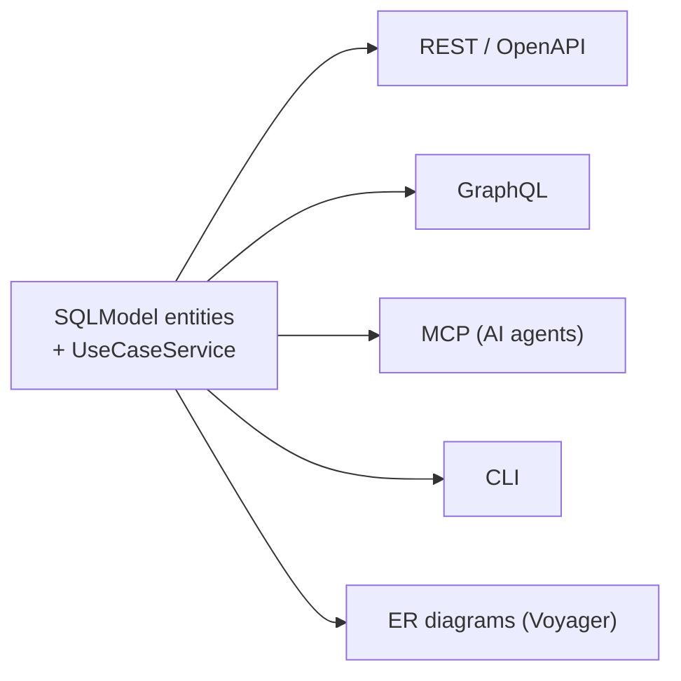

# nexusx

[](https://pypi.python.org/pypi/nexusx)
[](https://pepy.tech/projects/nexusx)

Write SQLModel entities and business methods once. Get a consistent, N+1-free
API across **REST, GraphQL, MCP, and CLI** — plus live ER diagrams — without
writing resolvers, DTOs, or schema by hand.



## What it does for you

**1. Build the data layer fast — and keep it legible.**

Declare SQLModel entities and relationships. nexusx reflects the SQLAlchemy
metadata into auto-batched DataLoaders, so a nested query like
`users { posts { comments } }` costs one SQL round-trip per level, not N+1 —
and field selection prunes all the way down to the columns read from disk. The
same metadata drives an interactive ER diagram ([Voyager](docs/advanced/voyager.md))
your whole team can read, not just whoever wrote it.

**2. Write each piece of business logic once — serve every interface.**

A `UseCaseService` method is plain async Python. One signature generates a
FastAPI route (with OpenAPI), a GraphQL field, an MCP tool for AI agents, and a
CLI command — sharing types, auth injection (`FromContext`), and field-level
selection.

The MCP path is built AI-first: agents discover the API through compact
`describe_*` tools instead of swallowing a 50K-token GraphQL introspection
dump. That is what makes nexusx worth reaching for over a single-protocol
stack — **the same codebase serves a web frontend (REST), power integrations
(GraphQL), and an AI agent (MCP) without rewriting the logic three times.**

## In 30 seconds

```python
from sqlmodel import SQLModel, Field, Relationship, select
from nexusx import query, GraphQLHandler
from nexusx.mcp import create_simple_mcp_server

class User(SQLModel, table=True):
    id: int | None = Field(default=None, primary_key=True)
    name: str
    posts: list["Post"] = Relationship(back_populates="author")  # ← the entire resolver

    @query
    async def users(cls, limit: int = 10) -> list["User"]:
        async with session() as s:
            return (await s.exec(select(cls).limit(limit))).all()

class Post(SQLModel, table=True):
    id: int | None = Field(default=None, primary_key=True)
    title: str
    author_id: int = Field(foreign_key="user.id")
    author: User | None = Relationship(back_populates="posts")

# GraphQL — { users { posts { title } } } is 2 SQL round-trips, not 1+N
GraphQLHandler(base=SQLModel, session_factory=session)

# MCP — Claude / Cursor call get_schema + graphql_query, fetching SDL on demand
create_simple_mcp_server(base=SQLModel, name="Blog", session_factory=session)
```

When logic spans entities, a `UseCaseService` becomes the single source — one
class → REST + MCP + GraphQL + CLI:

```python
from nexusx import (
    query, UseCaseService, UseCaseAppConfig,
    create_use_case_router, create_use_case_graphql_mcp_server,
)

class SprintService(UseCaseService):
    @query
    async def list_sprints(cls) -> list[SprintSummary]:
        """Get all sprints with task counts."""
        ...

cfg = UseCaseAppConfig(name="project", services=[SprintService])
app.include_router(create_use_case_router(cfg))        # REST + OpenAPI
create_use_case_graphql_mcp_server(apps=[cfg]).run()   # MCP for AI agents
```

## When to reach for it

- You need **more than one transport** from one codebase — REST + GraphQL, or app + AI agent.
- You want **N+1 prevention and column pruning for free**, driven by what the client actually selects.
- You have **non-ORM relations** (Redis, search, external APIs) that should flow through the same loader / DTO / diagram plumbing as native ones.

## When *not* to

- You only ever need **one REST handler per endpoint** and are happy writing them by hand — plain FastAPI is simpler.
- You want **fine-grained resolver control** over a large GraphQL schema — Strawberry gives you more knobs.

## Install

```bash
pip install nexusx
pip install nexusx[fastmcp]   # MCP support
```

Requires Python ≥ 3.10.

## Learn more

- [Quick Start](docs/guide/quick_start.md) — entities, DTOs, the UseCase layer
- [Feature highlights](docs/feature-highlights.md) — the design decisions, in depth
- [Voyager visualization](docs/advanced/voyager.md) — interactive ER + service diagrams
- [Clean Architecture comparison](docs/clean-architecture-comparison.md)
- [Changelog](docs/changelog.md)
- Demos: `bash start_all.sh` · [4-phase AI skill](skills/nexusx-4phase/)

## Status

**Stable** — follows semantic versioning. Bug reports and PRs welcome. MIT.
