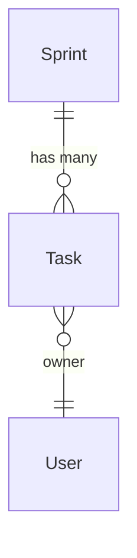

# ER 图可视化

nexusx 提供两种可视化方式：**Mermaid 文本输出**（适合嵌入文档）和 **Voyager 交互式可视化**（适合开发调试和团队协作）。

## 方式一：Mermaid 文本输出

适合嵌入 README、PR、Wiki 等静态文档场景。

### ErDiagram 类

```python
from nexusx import ErDiagram

# 直接从 SQLModel 实体构建
diagram = ErDiagram.from_sqlmodel([Sprint, Task, User])

# 或复用 ErManager 注册表，并包含虚拟实体
diagram = ErDiagram.from_er_manager(er)
```

### 生成输出

```python
print(diagram.to_mermaid())
```

输出示例：



### 在 Markdown 中嵌入

````markdown

````

GitHub、GitLab 和大多数 Markdown 渲染器都支持 Mermaid 语法。

### 可用方法

| 方法 | 返回值 | 说明 |
|------|--------|------|
| `ErDiagram.from_sqlmodel(entities)` | `ErDiagram` | 构建纯 SQLModel 图 |
| `ErDiagram.from_er_manager(er)` | `ErDiagram` | 构建包含 SQLModel 与虚拟实体的图 |
| `diagram.to_mermaid()` | `str` | Mermaid ER 图字符串 |
| `diagram.entities` | `list[EntityInfo]` | 实体与关系的结构化信息 |

## 方式二：Voyager 交互式可视化

nexusx 内置 Voyager 模块，提供基于 Web 的交互式可视化，同时展示 UseCase 服务结构和 ER 实体关系。

### 快速开始

```python
from nexusx.voyager import create_use_case_voyager
from fastapi import FastAPI

# 创建 Voyager 应用
voyager = create_use_case_voyager(
    services=[SprintService, TaskService],
    er_manager=er,  # 可选：集成 ER 图
)

# 挂载到 FastAPI
app = FastAPI()
app.mount("/voyager", voyager)
```

访问 `http://localhost:8000/voyager` 即可看到交互式界面。

### 功能

- **服务图**：展示 UseCaseService 方法及其 DTO 依赖关系
- **ER 图**：展示 SQLModel 实体关系（ORM + 自定义）
- **DOT 渲染**：Graphviz 格式的关系图
- **交互式浏览**：搜索、过滤、缩放
- **DefineSubset 追踪**：展示 DTO → 源实体的对应关系

### REST 端点

| 端点 | 说明 |
|------|------|
| `GET /dot` | 初始服务依赖图 |
| `POST /dot-search` | 搜索服务和 DTO 节点 |
| `POST /er-diagram` | ER 图数据 |
| `POST /source` | 源代码信息 |

## 选择指南

| 场景 | Mermaid | Voyager |
|------|---------|---------|
| 嵌入 README / 文档 | 适合 | 不适合 |
| PR / Wiki 讨论图 | 适合 | 不适合 |
| 开发阶段快速验证 | 一般 | 非常适合 |
| 团队协作讨论 | 一般 | 非常适合 |
| 调试关系加载 | 不适合 | 非常适合 |

## 建模讨论工作流

1. **定义实体**：SQLModel 定义业务实体
2. **声明关系**：ORM 关系自动发现 + 非 ORM 关系手动声明
3. **快速验证**：启动 Voyager，浏览器中交互式检查关系是否正确
4. **文档化**：用 `diagram.to_mermaid()` 生成 Mermaid，嵌入文档

## 下一步

- [Voyager 进阶](../advanced/voyager.zh.md) — Voyager 完整配置和高级功能
- [自定义关系](./custom_relationship.zh.md) — 扩展 ER 图中的非 ORM 关系
- [ER 图与非 ORM 关系](./er_diagram.zh.md) — 关系声明和自动发现
