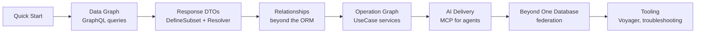

# Overview — One Model, Two Graphs

nexusx builds applications for humans and AI from the same source: you model
your business **once** — entities, relationships, and use cases — and every
delivery surface derives from that single model. This page is the map; each
section links into the guide.

## The model

A nexusx application is three declarations:

| Declaration | What it expresses | Where it lives |
|---|---|---|
| **Entities** | Business data and its connections | `SQLModel` classes |
| **Relationships** | Edges in the graph — ORM or beyond (Redis, search, external APIs) | `Relationship` / `RemoteRelationship` |
| **Use cases** | Business operations, typed and testable | `UseCaseService` methods |

Nothing else is re-declared per layer. The GraphQL schema, REST routes, MCP
tools, CLI commands, and the TS SDK are **projections** of this model, not
copies of it.

## Two graphs

nexusx exposes GraphQL in two places because they solve different problems:

|  | Data graph | Operation graph |
|---|---|---|
| Entry point | `GraphQLHandler` | `UseCaseService` |
| Source | SQLModel entities and relationships | Typed business methods |
| Main purpose | Browse and slice connected data | Invoke application operations |
| Typical users | Developers and internal tools | Web clients, integrations, AI agents |

- The **data graph** gives every entity `by_id` / `by_filter` roots. You write
  no relationship resolvers — SQLAlchemy relationships become DataLoader-backed
  edges, N+1-proof by construction. Start with [GraphQL Mode](graphql_mode.md).
- The **operation graph** turns each `UseCaseService` method into a stable
  capability, served over REST + OpenAPI, GraphQL, MCP, CLI, and TS SDK from
  one definition. Start with [UseCase Service](../advanced/use_case_service.md).

Applications use either one, or both.

## One model, six deliveries

| Delivery | What you get | Entry point |
|---|---|---|
| GraphQL · data graph | `by_id` / `by_filter` browsing | `GraphQLHandler` |
| GraphQL · operation graph | Typed fields via the compose schema | `compose_query` |
| REST + OpenAPI | Typed FastAPI routes | `create_use_case_router(api)` |
| MCP | Progressive disclosure for AI agents | `create_use_case_graphql_mcp_server([api])` |
| CLI | Services become command groups, `--select` projection | `create_use_case_cli(api)` |
| TS SDK | Typed client from the compose schema | 4-phase skill / schema |

Because every delivery derives from the same typed method, changing a
business rule updates all of them in sync — maintenance cost does not
multiply per protocol.

## Three ideas behind nexusx

1. **Selection is first-class.** One field selection shapes the GraphQL
   response, the SQL columns loaded, the DTO fields copied, the MCP output,
   CLI `--select`, and whether `total_count` is even computed.
2. **Relationships are not limited to the ORM.** Redis, search engines,
   other databases, external APIs — declare a `Relationship` with an async
   batch function and they join the same loader, DTO, GraphQL, and ER-diagram
   infrastructure. See [Custom Relationships](custom_relationship.md).
3. **Delivery is layered on later.** Business methods depend on no protocol
   object; builders inspect the typed signature and attach the right adapter.
   `FromContext` injects trusted values (user, tenant) without exposing them
   as client arguments.

## Reading path

The guide is organized along the model:

- **Explore data first** → [Quick Start](quick_start.md), then
  [Auto-Generated Queries](graphql_auto_query.md) and
  [Pagination](graphql_pagination.md).
- **Shape API responses** → [Core API Mode](core_api.md) and
  [Core API Advanced](core_api_advanced.md).
- **Connect non-ORM data** → [Custom Relationships](custom_relationship.md),
  [Virtual Entities](virtual_entities.md).
- **Expose business operations** → [UseCase Service](../advanced/use_case_service.md),
  [UseCase + FastAPI](../advanced/use_case_fastapi.md).
- **Serve AI agents** → [Compose MCP for AI](../advanced/compose_mcp.md) and
  [MCP & Context Efficiency](../mcp-context-efficiency.md).
- **Scale out** → [Federation](../advanced/federation.md),
  [ComposedErManager](../advanced/composed_er_manager.md).
- **See the whole picture** → [Voyager Visualization](../advanced/voyager.md).

For the fastest start with an agent, see the
[4-phase skill](https://github.com/KLR-Pattern/nexusx/tree/master/skills/nexusx-4phase) —
installable into Claude Code, Codex, or Cursor, it drives the whole workflow
from domain modeling to the TS SDK.
