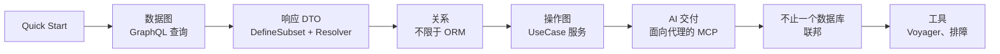

# 总览 —— 一个模型，两张图

nexusx 从同一份源构建面向人类与 AI 的应用：把业务**建模一次**——实体、
关系与用例——所有交付面都从这一份模型派生。本页是地图，每一节都链接到
对应指南。

## 模型是什么

一个 nexusx 应用由三份声明构成：

| 声明 | 表达什么 | 载体 |
|---|---|---|
| **实体** | 业务数据及其关联 | `SQLModel` 类 |
| **关系** | 图上的边 —— ORM 之内或之外（Redis、搜索、外部 API） | `Relationship` / `RemoteRelationship` |
| **用例** | 业务操作，类型化、可测试 | `UseCaseService` 方法 |

除此之外，任何一层都不需要重复声明。GraphQL schema、REST 路由、MCP 工具、
CLI 命令与 TS SDK 都是这张模型的**投影**，而不是复制品。

## 两张图

nexusx 在两个地方暴露 GraphQL，因为它们解决不同的问题：

|  | 数据图 | 操作图 |
|---|---|---|
| 入口 | `GraphQLHandler` | `UseCaseService` |
| 来源 | SQLModel 实体与关系 | 类型化业务方法 |
| 主要用途 | 浏览、切片关联数据 | 调用应用的业务操作 |
| 典型用户 | 开发者、内部工具 | Web 客户端、集成方、AI 代理 |

- **数据图**为每个实体提供 `by_id` / `by_filter` 查询根。不需要写任何
  关系 resolver —— SQLAlchemy 关系自动成为 DataLoader 支撑的边，构造上
  就不会 N+1。从 [GraphQL 模式](graphql_mode.md) 开始。
- **操作图**把每个 `UseCaseService` 方法变成一个稳定能力，一份定义同时
  服务 REST + OpenAPI、GraphQL、MCP、CLI 与 TS SDK。从
  [UseCase 服务](../advanced/use_case_service.md) 开始。

应用可以只用其一，或两者并用。

## 一次建模，六种交付

| 交付 | 得到什么 | 入口 |
|---|---|---|
| GraphQL · 数据图 | `by_id` / `by_filter` 浏览 | `GraphQLHandler` |
| GraphQL · 操作图 | 经 compose schema 的类型化字段 | `compose_query` |
| REST + OpenAPI | 类型化 FastAPI 路由 | `create_use_case_router(api)` |
| MCP | 面向 AI 代理的渐进披露 | `create_use_case_graphql_mcp_server([api])` |
| CLI | 服务即命令组，`--select` 投影 | `create_use_case_cli(api)` |
| TS SDK | 从 compose schema 生成的类型化客户端 | 4-phase skill / schema |

因为每种交付都派生自同一个类型化方法，业务规则改一处、全部同步更新
—— 维护成本不随协议数翻倍。

## nexusx 背后的三个想法

1. **Selection 是一等公民。** 一次字段选择同时决定：GraphQL 响应形状、
   SQL 加载的列、拷贝进 DTO 的字段、MCP 返回、CLI `--select`，以及
   `total_count` 是否计算。
2. **关系不限于 ORM。** Redis、搜索引擎、其他数据库、外部 API ——
   声明一个带异步批量函数的 `Relationship`，即可加入同一套 loader、DTO、
   GraphQL 与 ER 图基础设施。见[自定义关系](custom_relationship.md)。
3. **交付后置分层。** 业务方法不依赖任何协议对象；构建器检查类型化签名
   后挂上合适的适配器。`FromContext` 注入可信值（用户、租户），不把它们
   暴露为客户端参数。

## 阅读路径

指南按照模型的层次组织：

- **先探索数据** → [Quick Start](quick_start.md)，然后是
  [自动查询](graphql_auto_query.md)与[分页](graphql_pagination.md)。
- **塑造 API 响应** → [Core API 模式](core_api.md)与
  [Core API 进阶](core_api_advanced.md)。
- **接入非 ORM 数据** → [自定义关系](custom_relationship.md)、
  [虚拟实体](virtual_entities.md)。
- **暴露业务操作** → [UseCase 服务](../advanced/use_case_service.md)、
  [UseCase + FastAPI](../advanced/use_case_fastapi.md)。
- **服务 AI 代理** → [Compose MCP](../advanced/compose_mcp.md)与
  [MCP 与 context 效率](../mcp-context-efficiency.md)。
- **向外扩展** → [联邦](../advanced/federation.md)、
  [ComposedErManager](../advanced/composed_er_manager.md)。
- **看清全貌** → [Voyager 可视化](../advanced/voyager.md)。

想用 Agent 最快上手，见
[4-phase skill](https://github.com/KLR-Pattern/nexusx/tree/master/skills/nexusx-4phase)——
可装进 Claude Code、Codex 或 Cursor，从领域建模一路驱动到 TS SDK。
