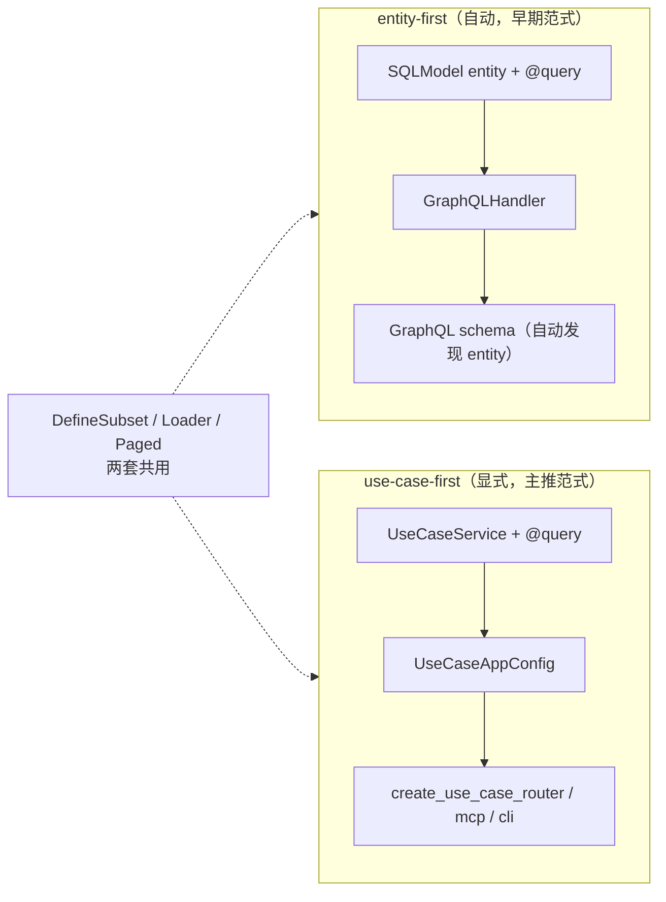

# nexusx 四阶段开发模式

基于 nexusx 的渐进式开发方法论：Phase 0 是需求与技术决策预检，Phase 1-4 是四个实施阶段。项目在一个 `src/` 目录下逐步演进，每个阶段允许在上一阶段基础上新增或修改代码。

## nexusx 原理与工作机制

> 在进入四阶段之前，先理解 nexusx 的核心抽象和机制 —— 这决定了每个阶段写什么、为什么这么写。

### nexusx 是什么

nexusx 是一个 **schema-to-interface 框架**：SQLModel entity + `GraphQLHandler` 生成 entity-first GraphQL；DefineSubset DTO + UseCaseService + UseCaseAppConfig 生成 REST、JSON-RPC、MCP、CLI 和 Compose GraphQL schema。TypeScript SDK 由 Phase 4 的 OpenAPI 工具生成，不是 nexusx 内部生成物。

### 四个核心抽象

| 抽象 | 职责 | 类比 |
|------|------|------|
| **SQLModel entity**（`table=True`） | 数据模型 + `@query`/`@mutation` 方法 | 数据库表 + 视图存储过程 |
| **DefineSubset**（DTO） | 视图层：字段选择 + `resolve_*`/`post_*` 计算字段 | GraphQL fragment + resolver |
| **Resolver** | DTO 树解析引擎（BFS + DataLoader 批量） | GraphQL execution engine |
| **ErManager** | entity 关系管理（DataLoader + federation 联邦） | ORM session + DataLoader registry |

```python
# ① entity — 数据模型 + @query 方法
class User(SQLModel, table=True):
    id: int | None = Field(default=None, primary_key=True)
    name: str
    @query
    async def by_name(cls, name: str) -> list["User"]: ...

# ② DefineSubset — 视图 DTO（字段选择 + 计算字段）
class UserSummary(DefineSubset):
    __subset__ = (User, ("id", "name"))
    display_name: str = ""
    def post_display_name(self) -> str: return self.name.upper()

# ③ ErManager — 关系管理底座（Resolver 内部用它）
er = ErManager(entities=[User, Post], session_factory=async_session)
```

### 两套暴露范式



- **entity-first**：`GraphQLHandler(base=BaseEntity)` → 自动发现 entity + `@query` → GraphQL schema。适合快速原型。
- **use-case-first**（**4phase 主推**）：`UseCaseService` + `UseCaseAppConfig` → 显式生成 REST / JSON-RPC / MCP / CLI / Compose GraphQL schema；GraphQL HTTP endpoint 需要按需挂载。适合生产应用。

```python
# entity-first：声明 entity → GraphQLHandler 自动生成 schema
handler = GraphQLHandler(base=Base, session_factory=sf)
result = await handler.execute('{ User { by_name(name: "Alice") { id name } } }')

# use-case-first：声明 Service → 生成 REST / MCP / CLI
class UserService(UseCaseService):
    @query
    async def list_users(cls) -> list[UserSummary]: ...
config = UseCaseAppConfig(name="api", services=[UserService])
app.include_router(create_use_case_router(config))
```

### 关键机制

- **DataLoader 批量**：所有关系加载走 DataLoader，自动 batch（防 N+1）。字段名匹配 entity 关系 → 隐式 auto-load；不匹配用 `Loader(name)` 显式指定。
- **Core API 原语**（在 DTO 上组合）：`resolve_*`（拉数据）、`post_*`（子节点就绪后计算）、`Loader`（DataLoader 注入）、`ExposeAs`/`SendTo`/`Collector`（跨层数据流）、`Paged`（字段级分页声明，固化）。
- **federation**（跨服务联邦）：member 声明 `__federation_keys__`（入口字段）+ `__pagination_orders__`（排序 profile），mounter 自动探测 + 批量拉取（β entity 路径 + γ DTO 路径）。无需 gateway/router。**注：federation 不在 4phase 流程内（单体应用），是独立的高级配置（见 `docs/advanced/federation.md`）。**
- **声明 vs 执行分离**：entity / DTO / service 声明数据、关系与用例，框架负责生成查询根和服务接口；Phase 4 再从 OpenAPI 生成 SDK。

```python
# DataLoader — 字段名匹配关系 → 自动批量加载（防 N+1）
class PostSummary(DefineSubset):
    __subset__ = (Post, ("id", "title"))
    author: UserSummary | None = None  # 匹配 Post.author → 隐式 auto-load

# Core API 原语 — 在 DTO 上组合
class SprintReport(DefineSubset):
    __subset__ = SubsetConfig(kls=Sprint, fields=["id", "name"],
                              expose_as=[("name", "sprint_name")])  # 暴露给子节点
    tasks: Annotated[list[TaskDTO], Paged(limit=5)] = []  # 字段级分页（固化）
    def post_contributors(self, c=Collector("contributors")): return c.values()

# federation — member 声明入口 + 排序，mounter 自动探测
class Review(SQLModel, table=True):
    __federation_keys__ = ["product_id"]           # 联邦入口字段
    __pagination_orders__ = BatchPageConfig(...)    # 排序 profile
```

### 一句话

**Phase 1 建模，Phase 2 实现并挂载业务方法，Phase 3 用 DTO + UseCaseService 生成所需接口，Phase 4 可选生成 TS SDK。**

> 📋 **4phase 常用 API + code snippet 速查**：见 [`references/api-reference.md`](references/api-reference.md)（17 类常用 API + 6.0 旧 API 迁移表）。

---

理解原理后，先执行 Phase 0 预检，再进入四个实施阶段：

| Phase | 职责 | 产出 |
|-------|------|------|
| **Phase 0** | 需求与技术决策预检 | 实体 + 关系 + 聚合根 + 用例方法 + DB/依赖决策 |
| **Phase 1** | Schema + ER Diagram + 聚合根入口 + mock seed | models + db(engine + session) + database(seed) + voyager |
| **Phase 2** | 业务方法实现 + Entity 挂载 | methods + mount_method + GraphQL 辅助测试 |
| **Phase 3** | UseCase 响应组装 + 服务接口 | dtos + services + 用户选定的 REST / JSON-RPC / MCP / CLI / Compose GraphQL + Voyager |
| **Phase 4** | OpenAPI spec → TS SDK（可选） | TypeScript SDK + 类型验收 |

## 核心原则

- **Phase 0 只阻塞不可安全推断的关键决策**（领域边界、DB、迁移、外部依赖）。现有项目中可从代码和配置确认的内容不重复询问
- **Phase 3 拼 DTO 前先用 ASCII tree 确认返回结构**：每个 UseCaseService method 一棵树，树根 = 返回类型注解，用户确认关联和字段后才写 `dtos.py`——提前锁定所有 method 的返回类型
- 非功能模块与业务模块解耦，业务概念不侵入基础设施层
- **验证必须可观察、可操作**——不写"代码健壮"，写"GraphiQL 中执行 X query 返回 Y"
- 新项目默认逐阶段交付并确认；用户明确要求端到端执行或现有项目增量迭代时，可连续完成多个阶段并在交付时集中汇报
- Phase 间递进：同一项目目录下逐步丰富，允许修改前一阶段文件，但不得破坏前序阶段已验证的行为

## 阶段实现

每个阶段开始时，读取当前阶段的详细指令：
- **Phase 0**: 读取 `phases/phase0.md`（需求确认 — 必须完成才能进入 Phase 1）
- **Phase 1**: 读取 `phases/phase1.md`
- **Phase 2**: 读取 `phases/phase2.md`
- **Phase 3**: 读取 `phases/phase3.md`
- **Phase 4**: 读取 `phases/phase4.md`

新项目的关键设计阶段默认等待用户确认；增量迭代或用户明确要求连续执行时，按 `spec-management.md` 的合并阶段规则处理。

对于 Spec 管理工作流（目录命名、文件格式、迭代规则、交付验证），读取 `spec-management.md`。


## 参考实现

读取本 skill 目录下 `template/` 中的代码作为可运行参考。复用其已验证模式，但必须根据业务域、数据库选型和启用的接口调整，不能机械复制未启用的模块。

## 项目结构

单项目渐进演进，每个 Phase 在上一阶段基础上新增文件：

```
src/
├── models.py       # Phase 1 纯实体 → Phase 2 从 methods 挂载 @query/@mutation
├── db.py           # Phase 1（engine + session factory，不依赖 models；URL 由 Step 0-7 DB 选型决定）
├── database.py     # Phase 1（in-memory: create_all+seed；持久化: no-op，schema 由 alembic 管）
├── service/        # Phase 2 新增 methods.py，Phase 3 补充 service.py/dtos.py
│   ├── auth/       # 按业务域划分（非按实体）
│   │   ├── methods.py  # Phase 2: 独立业务方法
│   │   ├── dtos.py     # Phase 3: DTO
│   │   ├── service.py  # Phase 3: UseCaseService
│   │   └── spec.md     # Phase 3: 服务说明
│   └── chat/
│       ├── methods.py
│       ├── dtos.py
│       ├── service.py
│       └── spec.md
├── main.py         # 逐步扩展（voyager → graphql → create_use_case_router → mcp）
tests/               # 按业务域组织自动化测试，避免 service 包内测试引发循环导入
├── test_auth_methods.py
└── test_chat_service.py
alembic/            # Phase 1 持久化场景才引入（file sqlite / docker / external）
├── env.py          # 接 SQLModel.metadata + sync URL + render_as_batch（sqlite）
├── script.py.mako  # 模板加 import sqlmodel
└── versions/       # 自动生成的迁移文件
scripts/            # Phase 1 持久化场景
└── load_seed.py    # 一次性把 var/seed_data.json 灌入文件 DB（保留 ID）
var/                # gitignored（file sqlite 场景）
├── <project_name>.db    # 实际 DB 文件
└── seed_data.json  # mock seed 数据
fe/                 # Phase 4 前端 SDK
├── openapi-ts.config.ts
├── package.json
└── src/sdk/        # 自动生成的 SDK
    ├── sdk.gen.ts      # SDK class（按 tag 分组）
    ├── types.gen.ts    # TS 类型定义
    └── client/         # HTTP client
```

**REST 路由通过 `create_use_case_router(use_case_config)` 自动生成**，不需要手写 `router/` 目录。也可使用 `create_use_case_jsonrpc_router()` 替代 REST（JSON-RPC 2.0 协议）。

## 阶段间变化对照

| 方面 | Phase 1 | Phase 2 | Phase 3 | Phase 4 |
|------|---------|---------|---------|---------|
| 实体 | 纯字段 + Relationship + docstring + mock seed | methods.py 实现 + `mount_method()` 挂载到 Entity | 继承 Phase 2 | - |
| 关系 | Relationship 声明 | 验证自动 DataLoader；按需补自定义 loader | DefineSubset 隐藏 FK、组装关系 | - |
| 查询 | 无方法 | methods.py + `mount_method()` 挂载 | UseCaseService 封装（复用 methods.py） | - |
| API | Voyager(ER diagram) | GraphiQL | GraphQL + 用户选定的 REST / JSON-RPC / MCP / CLI + Voyager | TS SDK（可选） |
| 响应 | N/A | 完整实体 | DefineSubset DTO | OpenAPI spec |
