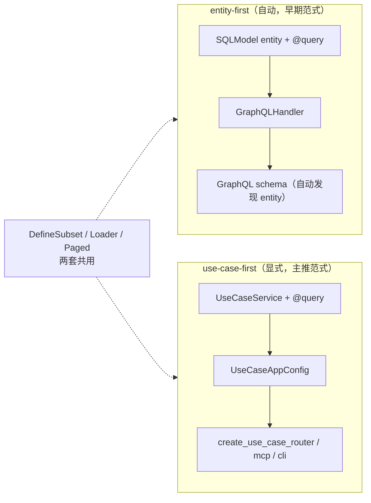

# nexusx 四阶段开发模式

基于 nexusx 的渐进式开发方法论。项目在一个 `src/` 目录下逐步演进，每个阶段在上一阶段基础上新增代码。

## nexusx 原理与工作机制

> 在进入四阶段之前，先理解 nexusx 的核心抽象和机制 —— 这决定了每个阶段写什么、为什么这么写。

### nexusx 是什么

nexusx 是一个 **schema-to-API 生成器**：你声明 SQLModel entity + DefineSubset DTO，框架自动生成 GraphQL schema、REST 路由、MCP server、CLI 和 TS SDK —— 零样板。

### 四个核心抽象

| 抽象 | 职责 | 类比 |
|------|------|------|
| **SQLModel entity**（`table=True`） | 数据模型 + `@query`/`@mutation` 方法 | 数据库表 + 视图存储过程 |
| **DefineSubset**（DTO） | 视图层：字段选择 + `resolve_*`/`post_*` 计算字段 | GraphQL fragment + resolver |
| **Resolver** | DTO 树解析引擎（BFS + DataLoader 批量） | GraphQL execution engine |
| **ErManager** | entity 关系管理（DataLoader + federation 联邦） | ORM session + DataLoader registry |

```python
# ① entity — 数据模型 + @query 方法
class User(SQLModel, table=True):
    id: int | None = Field(default=None, primary_key=True)
    name: str
    @query
    async def by_name(cls, name: str) -> list["User"]: ...

# ② DefineSubset — 视图 DTO（字段选择 + 计算字段）
class UserSummary(DefineSubset):
    __subset__ = (User, ("id", "name"))
    def post_count(self) -> int: return len(self.posts)  # post_* 计算字段

# ③ ErManager — 关系管理底座（Resolver 内部用它）
er = ErManager(entities=[User, Post], session_factory=async_session)
```

### 两套暴露范式



- **entity-first**：`GraphQLHandler(base=BaseEntity)` → 自动发现 entity + `@query` → GraphQL schema。适合快速原型。
- **use-case-first**（**4phase 主推**）：`UseCaseService` + `UseCaseAppConfig` → 显式生成 REST / MCP / CLI / GraphQL。适合生产应用。

```python
# entity-first：声明 entity → GraphQLHandler 自动生成 schema
handler = GraphQLHandler(base=Base, session_factory=sf)
result = await handler.execute('{ User { by_name(name: "Alice") { id name } } }')

# use-case-first：声明 Service → 生成 REST / MCP / CLI
class UserService(UseCaseService):
    @query
    async def list_users(cls) -> list[UserSummary]: ...
config = UseCaseAppConfig(name="api", services=[UserService])
app.include_router(create_use_case_router(config))
```

### 关键机制

- **DataLoader 批量**：所有关系加载走 DataLoader，自动 batch（防 N+1）。字段名匹配 entity 关系 → 隐式 auto-load；不匹配用 `Loader(name)` 显式指定。
- **Core API 原语**（在 DTO 上组合）：`resolve_*`（拉数据）、`post_*`（子节点就绪后计算）、`Loader`（DataLoader 注入）、`ExposeAs`/`SendTo`/`Collector`（跨层数据流）、`Paged`（字段级分页声明，固化）。
- **federation**（跨服务联邦）：member 声明 `__federation_keys__`（入口字段）+ `__pagination_orders__`（排序 profile），mounter 自动探测 + 批量拉取（β entity 路径 + γ DTO 路径）。无需 gateway/router。**注：federation 不在 4phase 流程内（单体应用），是独立的高级配置（见 `docs/advanced/federation.md`）。**
- **声明 vs 执行分离**：entity / DTO 只声明「是什么」（数据 + 能力标记），框架负责「怎么执行」（生成查询根、路由、MCP、SDK）。

```python
# DataLoader — 字段名匹配关系 → 自动批量加载（防 N+1）
class PostSummary(DefineSubset):
    __subset__ = (Post, ("id", "title"))
    author: UserSummary | None = None  # 匹配 Post.author → 隐式 auto-load

# Core API 原语 — 在 DTO 上组合
class SprintReport(DefineSubset):
    __subset__ = SubsetConfig(kls=Sprint, fields=["id", "name"],
                              expose_as=[("name", "sprint_name")])  # 暴露给子节点
    tasks: Annotated[list[TaskDTO], Paged(limit=5)] = []  # 字段级分页（固化）
    def post_contributors(self, c=Collector("contributors")): return c.values()

# federation — member 声明入口 + 排序，mounter 自动探测
class Review(SQLModel, table=True):
    __federation_keys__ = ["product_id"]           # 联邦入口字段
    __pagination_orders__ = BatchPageConfig(...)    # 排序 profile
```

### 一句话

**声明 entity + DTO（Phase 1-2），框架生成一切 API 形态（Phase 3-4）。**

> 📋 **完整 public API + code snippet 速查**：见 [`references/api-reference.md`](references/api-reference.md)（17 类 API + 6.0 旧 API 迁移表）。

---

理解原理后，以下是四阶段流程：

| Phase | 职责 | 产出 |
|-------|------|------|
| **Phase 0** | 需求确认 | 实体 + 关系 + 聚合根 + 用例方法（与用户反复确认） |
| **Phase 1** | Schema + ER Diagram + 聚合根入口 + mock seed | models + db(engine + session) + database(seed) + voyager |
| **Phase 2** | Loader 实现 | models 方法体实现，GraphQL 可查询 |
| **Phase 3** | UseCase 响应组装 + MCP | dtos + services + REST（或 JSON-RPC）+ MCP + CLI + Voyager 补充 services |
| **Phase 4** | OpenAPI spec → TS SDK | 端到端 SDK |

## 核心原则

- **需求确认是 Phase 0，必须反复与用户确认后才能进入 Phase 1**（详见下方「Phase 0: 需求确认」）
- 非功能模块与业务模块解耦，业务概念不侵入基础设施层
- **每个 Phase 采用 V 型验收：先定义验收标准（V 降），再实现，最后回查验收（V 升）**
- **每个 Phase 实现完成后必须暂停，展示验收结果，等用户确认后再进入下一阶段**
- Phase 间递进：同一项目目录下逐步丰富，只新增不修改已有代码

### V 型验收模型（贯穿所有 Phase）

每个 Phase 的结构统一为三段：

```
┌──────────────────────────────────────────────┐
│ V 降：定义验收标准                              │
│   "在当前 Phase 开始之前，先定义什么算做完。"      │
│   写入 spec/<phase>.md 的"验收标准"部分            │
└──────────────────────────────────────────────┘
                      ↓
              ┌───────────────┐
              │   实现 Phase   │
              └───────────────┘
                      ↓
┌──────────────────────────────────────────────┐
│ V 升：逐条回查验收                             │
│   "一条一条对照验收标准，通过才可继续。"           │
│   用户逐条确认 → 写入 spec/<phase>.md             │
└──────────────────────────────────────────────┘
```

验收标准必须是**可观察、可操作的**——不写"代码健壮"，写"GraphiQL 中执行 X query 返回 Y"。

## 阶段实现

每个阶段开始时，读取当前阶段的详细指令：
- **Phase 0**: 读取 `phases/phase0.md`（需求确认 — 必须完成才能进入 Phase 1）
- **Phase 1**: 读取 `phases/phase1.md`
- **Phase 2**: 读取 `phases/phase2.md`
- **Phase 3**: 读取 `phases/phase3.md`
- **Phase 4**: 读取 `phases/phase4.md`

每个阶段完成后，继续进行下一阶段之前暂停并等待用户确认。

对于 Spec 管理工作流（目录命名、文件格式、迭代规则、交付验证），读取 `spec-management.md`。


## 参考实现

读取本 skill 目录下 `template/` 中的代码作为生成参考。严格遵守 template 中的文件结构、import 风格和命名约定。

## 项目结构

单项目渐进演进，每个 Phase 在上一阶段基础上新增文件：

```
src/
├── models.py       # Phase 1 纯实体 → Phase 2 从 methods 挂载 @query/@mutation
├── db.py           # Phase 1（engine + session factory，不依赖 models；URL 由 Step 0-7 DB 选型决定）
├── database.py     # Phase 1（in-memory: create_all+seed；持久化: no-op，schema 由 alembic 管）
├── service/        # Phase 2 新增 methods.py，Phase 3 补充 service.py/dtos.py
│   ├── auth/       # 按业务域划分（非按实体）
│   │   ├── methods.py  # Phase 2: 独立业务方法
│   │   ├── dtos.py     # Phase 3: DTO
│   │   ├── service.py  # Phase 3: UseCaseService
│   │   ├── test.py     # Phase 3: unittest, file or folder, depends on complexity
│   │   └── spec.md     # Phase 3: 服务说明
│   └── chat/
│       ├── methods.py
│       ├── dtos.py
│       ├── service.py
│       ├── test.py
│       └── spec.md
├── main.py         # 逐步扩展（voyager → graphql → create_use_case_router → mcp）
alembic/            # Phase 1 持久化场景才引入（file sqlite / docker / external）
├── env.py          # 接 SQLModel.metadata + sync URL + render_as_batch（sqlite）
├── script.py.mako  # 模板加 import sqlmodel
└── versions/       # 自动生成的迁移文件
scripts/            # Phase 1 持久化场景
└── load_seed.py    # 一次性把 var/seed_data.json 灌入文件 DB（保留 ID）
var/                # gitignored（file sqlite 场景）
├── <project_name>.db    # 实际 DB 文件
└── seed_data.json  # mock seed 数据
fe/                 # Phase 4 前端 SDK
├── openapi-ts.config.ts
├── package.json
└── src/sdk/        # 自动生成的 SDK
    ├── sdk.gen.ts      # SDK class（按 tag 分组）
    ├── types.gen.ts    # TS 类型定义
    └── client/         # HTTP client
```

**REST 路由通过 `create_use_case_router(use_case_config)` 自动生成**，不需要手写 `router/` 目录。也可使用 `create_use_case_jsonrpc_router()` 替代 REST（JSON-RPC 2.0 协议）。

## 阶段间变化对照

| 方面 | Phase 1 | Phase 2 | Phase 3 | Phase 4 |
|------|---------|---------|---------|---------|
| 实体 | 纯字段 + Relationship + docstring + mock seed | methods.py 实现 + `mount_method()` 挂载到 Entity | 继承 Phase 2 | - |
| 关系 | Relationship 声明 | DataLoader 实现 | DefineSubset 隐藏 FK | - |
| 查询 | 无方法 | methods.py + `mount_method()` 挂载 | UseCaseService 封装（复用 methods.py） | - |
| API | Voyager(ER diagram) | GraphiQL | GraphQL + REST（或 JSON-RPC）+ Voyager(+services) + MCP + CLI | TS SDK |
| 响应 | N/A | 完整实体 | DefineSubset DTO | OpenAPI spec |
