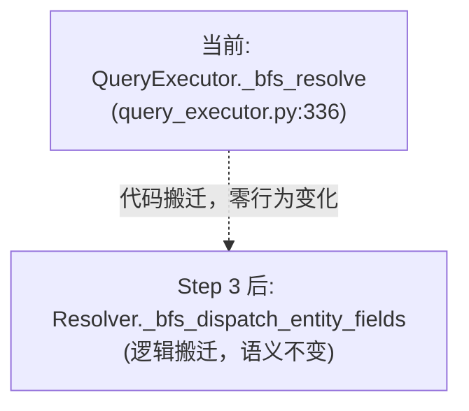

# Data Model: DTO-first gql execution

> 描述 4 个 Step 引入/扩展的数据结构。entity / DTO / federation 协议层的"实体"不变（见 specs/012/016），本文档只列**新引入或扩展形状**。

## Step 1：build_response_model 扩展（response_builder.py）

### ModelTree（动态构建产物）

`build_response_model(entity, field_tree)` 输出的动态 pydantic model 树。每个节点：

```python
# 输入 field_tree（从 gql FieldSelection 派生）
{
    "id": None,                    # scalar
    "name": None,                  # scalar
    "author": {"name": None},      # nested to-one
    "reviews": {"title": None},    # nested to-many
}

# 输出（动态 model）
class ProductResponse(Product, frozen=True):
    id: int
    name: str
    author: AuthorResponse | None     # nested model（动态）
    reviews: list[ReviewsResponse]    # nested model list（动态）
```

### PaginatedResponse（Step 1 扩展，新形状）

`field_tree` 识别 paginated package（`sub_fields = {items, pagination}`）：

```python
# 输入 field_tree（paginated）
{
    "items": {"title": None},
    "pagination": {"has_more": None},
}

# 输出（动态 model，复用 pagination.create_result_type）
class ReviewsPaginatedResponse:
    items: list[ReviewsItemResponse]   # nested model list（动态）
    pagination: PaginationResponse     # 动态构建，只含 has_more
```

跟 `_serialize_paginated_package`（query_executor.py:669）行为等价，但用 model-based 而非 dict-based。

### MaterializedForwardRefResolver（Step 1 扩展）

`_resolve_forward_reference`（response_builder.py:136）当前只搜 `all_subclasses`（SQLModel 实体集）。扩展接收 `optional federation_namespace: dict[str, type]`，先搜 federation 物化的 remote type，再搜本地 subclasses。

## Step 2：Paged[X] 字段 metadata（新结构）

### PagedAnnotation（DTO field metadata）

`Annotated[list[X], Paged(...)]` 表达 gql selection 的 pagination 参数：

```python
# gql selection
reviews(limit: 5, order: HIGHEST_RATING) { items {} pagination {} }

# build_response_model 输出
class ProductResponse:
    reviews: Annotated[
        list[ReviewsItemResponse],
        Paged(limit=5, order="HIGHEST_RATING", direction=None),
    ]
```

### Paged（已有，复用）

`Paged`（pagination.py:65）已存在 dataclass：

```python
@dataclass(frozen=True)
class Paged:
    limit: int | None = None
    offset: int = 0
    order: str | None = None
    direction: str | None = None

    def params_key(self) -> tuple:
        return (self.limit, self.offset, self.order, self.direction)
```

Step 2 在 build_response_model 时把 gql arguments（`limit`/`offset`/`order`/`direction`）注入到 `Annotated[..., Paged(...)]`。

### PagedFieldSpec（Step 2 内部结构）

build_response_model 内部识别一个 field 是 paged 的判据：

```python
@dataclass
class PagedFieldSpec:
    item_type: type[BaseModel]      # items 的 subset model
    pagination_selection: set[str]  # {has_more, total_count}
    paged: Paged                    # gql args 派生
```

Resolver 处理 Paged field 时读 `Paged` metadata，触发 page_loader（跟 specs/015 + γ Paged default + caller override 链路对齐）。

## Step 3：Resolver dispatch（resolver.py 扩展）

### EntityFieldDispatchJob（新内部结构）

Resolver 接管 entity-first 的 BFS dispatch 后的内部 job 结构：

```python
@dataclass
class EntityFieldDispatchJob:
    parents: list[SQLModel]               # 当前 level 的 parent 实体
    parent_entity: type[SQLModel]
    rel_info: RelationshipInfo            # 当前 field 的关系信息
    field_sel: FieldSelection            # gql 子选择
    paged: Paged | None                  # Step 2 注入的 metadata（None = 非 paged）
```

Resolver 接收 build_response_model 构造的动态 DTO（带 `Annotated[..., Paged(...)]` metadata），扫描每个字段：
- scalar：直接 dump
- nested model：递归 dispatch
- `Annotated[list[X], Paged(...)]`：触发 page_loader（用 Paged metadata）
- `Annotated[list[X]]`（无 Paged）：触发 plain loader

### Resolver BFS dispatch 跟当前 _bfs_resolve 的语义对齐



## Step 4：fetch_dto_subtree（federation/remote_loader.py 新增）

### FetchDtoSubtreeArgs（新参数对象）

对称 `fetch_remote_subtree`，但服务 γ：

```python
@dataclass
class FetchDtoSubtreeArgs:
    registry: Any                     # ErManager
    dto_loader_cls: type[DataLoader]  # γ DTO RemoteLoader（来自 _dto_loaders）
    parents: list[BaseModel]          # owner DTO 实例
    field_name: str                   # owner DTO 上的 field
    page_params: Paged | None         # γ 分页参数（per-call override）
```

fetch_dto_subtree 内部：
1. `registry.get_loader(dto_loader_cls, params_key=page_params.params_key())`
2. `set_dto_page_params(loader, page_params)`（如非 None）
3. `loader.load_many([getattr(p, fk_field) for p in parents])`

跟 `fetch_remote_subtree`（β 入口）对称。

## 不变式

- **entity-first 开发体验**：用户写 `@query method -> list[Entity]` 不变，executor 内部 build_response_model 是实现细节。
- **β federation 协议**：member 端 gql batch root + selection-driven 语义不变。
- **γ federation 协议**：member 端 `/nexusx/dto-batch` + mounter Resolver 组合不变。
- **UseCase 模式 build_subset_model**：保持独立，不并入 response_builder（前者服务 UseCase compose，后者服务 entity-first gql）。
- **零回归 gate**：Step 1（feature flag on / off）输出 diff 必须为空；Step 3（Resolver 接管 β）1429 测试零失败。
