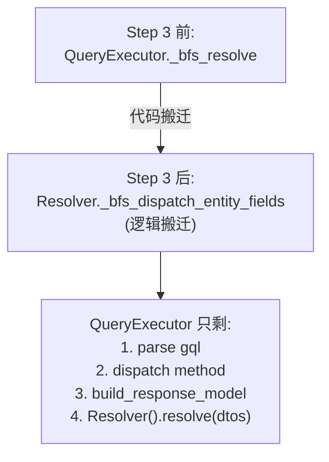

# Research: DTO-first gql execution（specs/018）

**Date**: 2026-08-05
**Status**: Phase 0 输出，4 个 unknowns 已盘清

参考：[spec.md](./spec.md)、[plan.md](./plan.md)

---

## Unknown 1：`_serialize` 边缘 case 盘点

### 调研对象

`QueryExecutor._serialize`（query_executor.py:610–813）当前处理的 6 类边缘 case，跟 `response_builder.build_response_model`（response_builder.py:17–62）现有能力的差异。

### 盘点结果

| # | `_serialize` 当前 case | `build_response_model` 当前覆盖？ | 差异 / 扩展策略 |
|---|---|---|---|
| 1 | **scalar 字段过滤**（按 field_sel 白名单取字段） | ✅ 已覆盖（response_builder.py:38–43） | 行为一致 |
| 2 | **nested relationship 递归**（to-one / to-many） | ✅ 已覆盖（response_builder.py:45–60） | 行为一致 |
| 3 | **paginated package**（`{items, pagination}` dict） | ❌ **未覆盖** | response_builder 加 `_build_paginated_model`：识别 `field_sel.sub_fields = {items, pagination}` 时构造 `{items: list[nested], pagination: Pagination}` shape；复用 `pagination.create_result_type`（pagination.py:104） |
| 4 | **relationship_value 序列化**（list / 单个 / paginated） | 部分（list / 单个 ✅；paginated ❌） | response_builder 的 `_serialize_with_model` 加 paginated 分支 |
| 5 | **FK 字段过滤**（`_filter_output` L785，去 FK + relationship 字段 + metadata） | ✅ 白名单机制天然过滤（field_tree 没有的字段不会出现） | 行为对齐：response_builder 白名单 vs _filter_output 黑名单 —— **白名单更安全**（不会漏字段） |
| 6 | **materialized remote type forward-ref**（federation 物化的 pydantic model，type hint 是 str forward-ref） | 部分（`_resolve_forward_reference` L136–174 处理 str forward-ref，但只搜 SQLModel subclasses，不搜 federation registry） | response_builder 加 `optional all_subclasses` 参数扩展到 federation registry 物化的 type（federation/registry.py 的 `_namespace`） |

### Decision

**Step 1 范围明确**：response_builder 需要补 2 个能力（paginated package、materialized remote type forward-ref），其他 case 当前覆盖或天然处理。

### Rationale

逐 case 比对代码，没发现不可逾越的 gap。paginated 是最复杂的扩展点（要拼 items + pagination 两层），但 `pagination.create_result_type` 已经有相同设计可复用。

### Alternatives considered

- **新建一套 entity-aware 的 build_subset_model**：rejected，跟激活 response_builder 重复，且要重新测全部 edge case。
- **保留 _serialize + 单独加 build_response_model 作为 fast path**：rejected，两套并存增加维护成本，且 _serialize 的 dict-based 模式最终要被淘汰。

---

## Unknown 2：DTO schema 缓存策略

### 调研对象

`build_response_model` 每次 query 调用 `pydantic.create_model` 的开销，以及是否需要按 `(entity, field_tree_canonical_hash)` 缓存。

### 现状

- `use_case/selection.build_subset_model`（selection.py:72）—— **无缓存**，每次 `_project_result` 都 create_model。
- `response_builder.build_response_model`（response_builder.py:17）—— **无缓存**，每次 `serialize_with_model` 都 create_model。
- UseCase 模式当前性能没报问题——单 query create_model 几十个 subset model 可接受。

### 性能模型分析

```
单次 create_model 开销 ≈ 1ms 量级（pydantic v2 build_schema）
单次 query 字段数    ≈ 10-30 个 nested model
单次 query schema 构建总开销 ≈ 10-30ms
```

跟 BFS DataLoader（典型 50–200ms，含 DB round-trip）相比，schema 构建开销 < 10%。

### Decision

**Phase 1（Step 1）：不缓存**——跟 selection.build_subset_model 对称，简化实现。
**Phase 2（如果 benchmark 显示回退 > 5%）：加缓存**——按 `(entity.__name__, canonical_field_tree_hash)` 缓存 create_model 结果，用 `functools.lru_cache` 或显式 dict。

### Rationale

- 缓存的 key 设计要稳定（field_tree 序列化要 canonical）。
- UseCase 模式没缓存也能跑，entity-first 模式单 query 字段数差不多，没必要过早优化。
- 真正的性能瓶颈通常在 DB（DataLoader batch），不在 schema 构建。

### Alternatives considered

- **预构建缓存（启动期 build all subsets）**：rejected，field_tree 组合无穷多，预构建不可行。
- **module-level dict 缓存 + LRU**：备选 Phase 2 方案，按响应大小（如 256 entries）做 LRU。

---

## Unknown 3：Resolver 接管 β federation 的语义对齐

### 调研对象

当前 `QueryExecutor._bfs_resolve`（query_executor.py:336）跟 `Resolver._batch_auto_load`（resolver.py:1501）的语义差异，以及 Resolver 接管 β 后的统一调度模型。

### 现状对比

| 维度 | QueryExecutor._bfs_resolve | Resolver._batch_auto_load |
|---|---|---|
| **调度模式** | BFS 层级遍历（L348–366）：每 level 并发 load 所有字段，结果作为下一层 parents | collect 多趟（resolver.py:1549–1686）：按 (node_type, rel_name) group，每 group 一次 batch |
| **page_loader 调用** | `_load_field_paginated` L438 + `_extract_page_args` L578 | `_merge_paged` + `PageLoadCommand`（resolver.py:1614+） |
| **β remote dispatch** | 直接调 `fetch_remote_subtree`（L456/469） | 直接调 `fetch_remote_subtree`（resolver.py:1582） |
| **γ DTO dispatch** | 不支持（gql 模式不识别 DTO field） | `_dto_loaders` + `set_dto_page_params`（resolver.py:523–538） |
| **coalesced 字段** | L386 skip（`REMOTE_COALESCED`） | 不处理（Resolver 不接 coalesced，已在数据层解决） |

### 关键差异：调度顺序 vs 数据正确性

BFS（query_executor）和 collect（Resolver）的调度顺序不同，但**最终结果一致**——因为：
- 两者都基于 aiodataloader 的 request-level cache（同一 key 不重复 load）
- 两者都跟 entity relationship 拓扑保证 children 在 parent 之后 load
- Resolver 的 collect 是"父→子"逐层（跟 BFS 等价），只是 grouping 不同

### Decision

**Resolver 接管 β 后，调度模型不变**——保留 BFS 语义，只是 caller 从 `QueryExecutor._bfs_resolve` 换成 `Resolver` 内部的一个新方法（暂名 `_bfs_dispatch_entity_fields`）。

### 实现路径



具体改动：
1. `query_executor._bfs_resolve` + `_build_field_jobs` + `_load_field` 整段**搬到** resolver.py（或新文件 `resolver_entity_dispatch.py`）
2. `QueryExecutor._resolve_result`（query_executor.py:293）改成调 `Resolver().resolve_entity_fields(result, entity, field_sel)`
3. β fetch_remote_subtree 调用方从 query_executor.py:456/469 删除（已在 resolver.py:1582）

### Rationale

- 搬迁而非重写——BFS 跟 Resolver collect 的"等价性"已经通过 1429 测试验证，重写风险大。
- Resolver 接管后，β / γ / 本地 rel 都通过 Resolver 调度，executor 退化成"parse + build_response_model + Resolver.resolve"。

### Alternatives considered

- **把 BFS 改成 Resolver collect 风格**：rejected，调度顺序差异虽然语义等价但实际行为有微妙差异（如 type_key split 时机），1429 测试要重写很多。
- **保留 QueryExecutor._bfs_resolve 作为独立模块**：rejected，跟"统一心智模型"目标冲突。

---

## Unknown 4：feature flag 切换策略

### 调研对象

`use_response_builder` flag 怎么注入、测试、切默认、deprecate 旧路径。

### 现状参考

nexusx 已经有类似 feature flag：`GraphQLHandler.__init__(enable_pagination: bool = False)`（handler.py:59）—— 切换是否启用 paginated Result type。可以参考这个模式。

### Decision

**4 阶段切换**：

1. **Step 1.a**：`GraphQLHandler.__init__(use_response_builder: bool = False)`；`QueryExecutor` 接 flag，if-else 走新/旧路径。默认 False（旧路径）。
2. **Step 1.b**：全量测试集（1429 + 新增的 flag-on 等价性测试）跑通，flag-on 跟 flag-off 行为完全一致。CI 跑两个 flag 值（matrix）。
3. **Step 1.c**：flag 默认 True。在 changelog / migration guide 里写明。旧路径标记 `# DEPRECATED`。
4. **Step 1.d**（Step 4 完成后）：删除旧路径 + 删除 flag。

### Rationale

- 跟 enable_pagination 的策略对称，用户熟悉。
- 4 阶段保证任何一步失败都可以单独 revert。
- Step 1.b 的"flag-on 等价性测试"是关键 gate——专门跑一个 fixture 集比对两路径输出。

### Alternatives considered

- **直接切换（无 flag）**：rejected，1429 测试一旦失败难定位（改动太大）。
- **环境变量控制（NEXUSX_USE_RESPONSE_BUILDER=1）**：rejected，运维不直观，难做 per-test 切换。

---

## 综合：Phase 0 → Phase 1 衔接

基于以上 4 个 unknowns 的结论，Phase 1 设计要点：

1. **data-model.md** 需要描述：
   - response_builder 扩展后的 model 树（scalar / nested / paginated / materialized forward-ref）
   - Paged[X] metadata 结构（Step 2 引入）

2. **contracts/** 需要 3 份契约：
   - **response_builder_api.md**：build_response_model 的输入（field_tree）+ 输出（dynamic model）契约，含 paginated package 扩展
   - **paged_field_metadata.md**：Step 2 的 `Annotated[list[X], Paged(limit=N, ...)]` 表达协议
   - **resolver_dispatch.md**：Step 3 的 Resolver._bfs_dispatch_entity_fields 输入/输出契约

3. **quickstart.md** 需要 4 个独立验证脚本：
   - Step 1：`use_response_builder=True` 跑全量测试，flag-on / flag-off 输出 diff 为空
   - Step 2：单测 build_response_model 对 `reviews(limit: 5)` 的输出
   - Step 3：grep `fetch_remote_subtree` 调用方收敛到 Resolver
   - Step 4：grep docstring，确认 fetch_remote_subtree / fetch_dto_subtree 对称

---

## 后续待 Phase 1 验证的事

- response_builder 加 paginated package 支持后，行为跟 `_serialize_paginated_package`（query_executor.py:669）逐字段对齐（写 fixture 比对）
- materialized remote type forward-ref 解析正确（用 specs/012 federation e2e 测试集）
- Resolver 接管 β 后，1429 测试零回归（实际跑）
- DTO schema 构建性能（用 cProfile 跑 representative gql query，确认 < 10% 回退）
