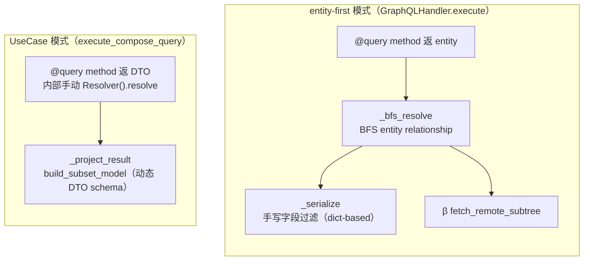
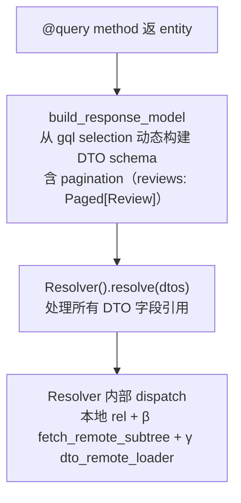
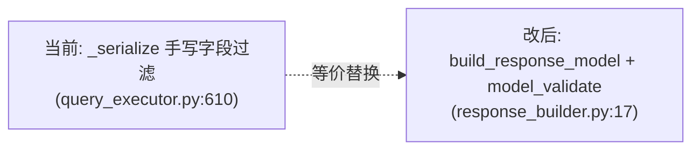
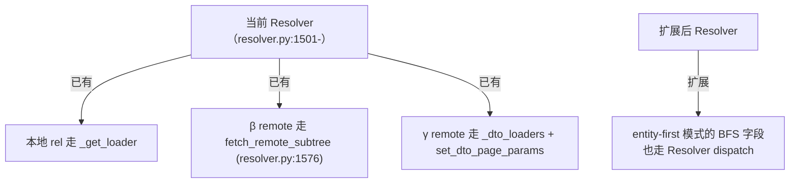

# Feature Specification: DTO-first gql execution（统一两条 gql 路径）

**Feature Branch**: `018-dto-first-gql-execution`

**Created**: 2026-08-05

**Status**: Draft（设计阶段，等架构讨论收敛）

**建立在**: `specs/012-federation`（β ER federation）+ `specs/016-dto-tree-federation`（γ DTO federation）+ `src/nexusx/response_builder.py`（已存在但未启用的动态 DTO 构建基建）+ `src/nexusx/use_case/selection.py:build_subset_model`（UseCase 模式对称机制）+ `src/nexusx/loader/pagination.py:create_result_type`（动态 Result type 基建）之上

**Input**: "graphql 模式主流程当前在 entity-first 与 UseCase 两条路径上分叉；理想形态是统一走'从 gql selection 动态构建 DTO schema → Resolver 解析'。pagination 参数在 DTO 转换过程中变成 paged 的结构（`reviews(limit: 5)` → `reviews: Paged[Review]`）。"

## 背景与动机

### 现状：两条 gql 执行路径，在 executor 层分叉

**entity-first 模式现状的 3 个"应该有但没有"**：
1. **没有"动态 DTO schema"**：`_serialize`（query_executor.py:610-）是手写字段过滤，不走 `response_builder.build_response_model`——而 entity 模式的对称机制（`response_builder`）已存在但被废弃（详见 [memory: project-response-builder-dormant]）。
2. **没有 Resolver**：`QueryExecutor` 全文无 `Resolver` 调用，entity 关系靠 BFS + DataLoader 直调，`fetch_remote_subtree`（β）由 executor 直接调用。
3. **没有"pagination 进 DTO field"**：pagination 在 `_load_field_paginated` + `_serialize_paginated_package`（query_executor.py:438/669）单独处理，跟 selection 解耦。

### 理想形态：entity-first 也走"动态 DTO schema + Resolver"

**收益**：
- **路径统一**：entity-first 与 UseCase 走同一套"动态 DTO + Resolver"心智模型，不再二分。
- **pagination 进入 DTO field**：`reviews(limit: 5)` 在构建 DTO 时变成 `reviews: Paged[Review]` 字段（[feedback-gamma-pagination-method-level] 的方向）。
- **β federation 退化成 Resolver 实现细节**：`fetch_remote_subtree` 不再被 executor 直接调用，跟 γ 一样由 Resolver dispatch。代码导航清晰。
- **schema 层过滤取代手写 dict 过滤**：复用 `response_builder`（已存在的设计），减少 `_serialize` 的手写复杂度。

## 关键边界

### 不动的层

- **ER diagram 概念**：entity 仍是 schema 主语，DTO 是派生（[project-entity-resource-no-computation] 纪律）。
- **entity-first 开发体验**：用户仍写 `@query method -> list[Entity]`，executor 内部多走一层 DTO 是实现细节，对用户透明。
- **β federation 协议**：gql batch root（`by_<key>_in` / `page_by_<key>_in`）、`fetch_remote_subtree` 的 selection-driven 语义不变。
- **γ federation 协议**：member `/nexusx/dto-batch` + mounter Resolver 组合的语义不变。

### 要改的层

- `QueryExecutor._serialize` → `build_response_model` + model_validate
- `_load_field_paginated` → pagination 进入 DTO field（`Paged[X]`）
- `fetch_remote_subtree` 调用方：从 query_executor 迁到 Resolver
- `response_builder.build_response_model`：扩展支持 pagination 字段 + federation remote types（materialized forward-ref）

## 模型概述

### Step 1：替换 _serialize（行为不变，零回归目标）

- 输入：method 返 entity + gql field_tree
- 输出：filtered dict（与当前一致）
- 增量价值：把 dict-based 手写过滤换成 model-based schema 过滤

**关键风险**：`_serialize` 当前处理的边缘情况（paginated package、materialized remote type forward-ref、UUID 序列化等）在 `build_response_model` 里是否完整支持。

### Step 2：扩展 build_response_model 支持 pagination

`response_builder` 当前只处理 scalar + nested relationship。要加：
- 识别 `Paged[X]` 字段类型（来自 `pagination.create_result_type`）
- 处理 `items` / `pagination` 子选择
- gql arguments（`limit`/`offset`/`order`/`direction`）注入到 **dynamic model 的 Annotated metadata**（`Annotated[..., Paged(limit=5)]`）—— 运行期注入到 build_response_model 输出的 model 上，**不在 entity 类加声明期 Annotated**（保持 entity-first 现状）。Resolver 读 metadata 触发 page_loader。

**层级对比**（entity-first vs γ）：
- **entity-first（本 spec Step 2）**：gql args（运行期） → dynamic model Annotated（运行期） → Resolver 读 metadata → page_loader
- **γ UseCase 模式（specs/016）**：field Annotated Paged default（声明期） + caller context override（运行期） → Resolver merge → page_loader

两条链路各自独立，不强行统一（entity-first 没有 field-level 声明 Annotated 的必要）。defaults 仍走 RelationshipInfo.default_page_size（specs/015）。

### Step 3：Resolver 接管 entity relationship dispatch

Resolver 已经有 β 入口（`is_remote_entry` 分支调 `fetch_remote_subtree`）和 γ 入口（`_dto_loaders`）。扩展点是让 entity-first gql 流程的"先 build DTO → Resolver.resolve"也走这套，不再由 `QueryExecutor._bfs_resolve` 单独 BFS。

### Step 4：fetch primitive 收编（specs/016 review 形态 A）

- `fetch_remote_subtree` docstring 改诚实（β-only，entity federation 专用，gql 入口）
- 新增 `fetch_dto_subtree`（γ 用，Core API 入口）
- **fetch_dto_subtree 替代** γ 当前的 `set_dto_page_params + load_many` 段（resolver.py:531-538）—— Resolver 改调 fetch_dto_subtree，跟 β dispatch 形态对称
- 两者都成为 Resolver 内部实现细节，不再被顶层 executor 直接调用

## Clarifications

### Session 2026-08-05（设计起手）

- **Q: 为什么不新建一套 build_subset_model 风格的代码，而是激活 response_builder？**
  - A: `response_builder` 是 entity 模式专用的对称设计，已存在、已被测过、设计意图明确。重新激活代价小于新建；且能避免"两套相似基建并存"的债。

- **Q: pagination 进 DTO field 会不会破坏 specs/014/015 的本地分页契约？**
  - A: 不会。`Paged[X]` 是 DTO field 的 metadata 表达（`Annotated[list[X], Paged(limit=5)]`），底层 `PageLoadCommand` / `PageArgs` 协议不变。gql schema 上 `reviews(limit: 5)` 仍接受 `limit` argument，只是 executor 内部把 argument 转成 DTO field metadata 而不是单独走 `_load_field_paginated`。

- **Q: 性能影响（多一层 DTO 构造 + model_validate）？**
  - A: 待 benchmark。预期：单 entity 序列化成本略增（pydantic validate vs dict 过滤），但 BFS N+1 行为不变（DataLoader 缓存共享）。如果显著回退，考虑保留 `_serialize` 作为 fast path。

- **Q: 迁移策略（不破坏 1429 测试）？**
  - A: Step 1（_serialize → build_response_model）必须零回归。先 feature flag（`use_response_builder=True`）跑全量测试，逐项 fix 边缘 case，最后切换默认值。Step 2/3/4 在 Step 1 稳定后做。

### Session 2026-08-05（clarify）

- Q: Step 1 等价性 fixture 集要覆盖多大范围？ → A: 全量 1429 测试跑 flag-on/off diff。018 改的是 entity-first gql 主流程，每个 entity 测试路径都受影响；少于全量都可能漏 case；1429 跑 ~36 秒，CI 成本可接受。
- Q: "回退 < 10%"的性能 baseline 怎么测？ → A: 写专门 gql benchmark 脚本（cProfile + latency），Step 1 / Step 3 完成后跑一次（不在 CI 每次 commit 跑）。脚本对比 flag-on vs flag-off 的 gql query 响应延迟 + schema 构建开销，给出量化报告。
- Q: build_response_model 失败（如 materialized forward-ref 解析不出、field_tree 含未知字段）时怎么处理？ → A: 直接 raise（fail-fast，不 fallback 到 _serialize）。Step 1 等价性测试（全量 1429）就是为了暴露所有失败 case；fallback 会隐藏问题，到 Step 1.c 切默认时反而爆炸。
- Q: Step 2 gql args（`reviews(limit: 5)`）跟现有 γ Paged default + caller override 链路怎么对齐？ → A: gql args 进 build_response_model 输出的 **dynamic model Annotated**（运行期注入），Resolver 读 metadata 触发 page_loader。**不**在 entity 类上加声明期 Annotated（保持 entity-first 现状）。跟 γ 的 field-level Annotated 是不同层（动态构建 vs 声明期），跟 specs/015 的 RelationshipInfo default_page_size 链路兼容（defaults 仍走 rel_info，gql args 覆盖）。
- Q: Step 4 抽 fetch_dto_subtree 后，γ 路径当前绕开 fetch primitive 的行为要改吗？ → A: 改。fetch_dto_subtree 替代 γ 当前的 `set_dto_page_params + load_many` 段（resolver.py:531-538），Resolver 改调 fetch_dto_subtree。这才是"对称 primitive"的真正含义——β 已把 `set_remote_selection + load_many` 包进 fetch_remote_subtree，γ 应对称。改完后 Resolver 的 γ dispatch 跟 β dispatch 形态一致。

## User Scenarios & Testing *(mandatory)*

### User Story 1 — entity-first gql 走 build_response_model（零回归）(Priority: P0)

把 `QueryExecutor._serialize` 替换成 `response_builder.build_response_model` + `model_validate`，全量 1429 测试零回归。

**Why this priority**: 基础切片——证明 response_builder 重新激活不破坏现有行为，是后续步骤的前置条件。

**Independent Test**: 用**全量 1429 测试**在 flag-on / flag-off 两个 `use_response_builder` 值下跑（CI matrix），比对响应 dict 一致（diff 为空）。少于全量都可能漏 case。

**Acceptance Scenarios**:
1. **Given** 任意 entity-first gql query，**When** 启用 `use_response_builder=True`，**Then** 响应跟旧路径（`_serialize`）逐字段相等。
2. **Given** paginated package query（`{ Product { by_filter { reviews { items {} pagination {} } } } }`），**When** 切换路径，**Then** paginated package 结构一致。
3. **Given** federation materialized remote type query，**When** 切换路径，**Then** forward-ref 解析正确。
4. **Given** build_response_model 遇到无法解析的边缘 case（forward-ref 找不到、field_tree 含未知字段），**When** flag-on，**Then** 直接 raise（fail-fast，不 fallback 到 `_serialize`）。

### User Story 2 — pagination 进 DTO field (Priority: P1)

`reviews(limit: 5)` 在 build_response_model 阶段变成 DTO field `reviews: Paged[Review]`（metadata: `Paged(limit=5)`），Resolver 触发 page_loader。

**Why this priority**: 核心架构切片——证明 pagination 不再单独处理，统一进 DTO field。

**Independent Test**: 单测 build_response_model：gql selection `{ reviews(limit: 5) { items {} pagination { has_more } } }` → DTO schema 里 `reviews` 字段是 `Paged[ReviewResult]` 且 metadata 含 `Paged(limit=5)`。

**Acceptance Scenarios**:
1. **Given** gql `reviews(limit: 5)`，**When** build_response_model，**Then** 字段类型是 Paged 包装，metadata 含 limit=5。
2. **Given** Resolver 处理 Paged 字段，**When** 触发 load，**Then** 走 page_loader（不是 plain loader），返 `{items, pagination}` 结构。
3. **Given** 不带 limit 的 gql `reviews`，**When** build_response_model，**Then** 字段类型是 `list[Review]`（不是 Paged）—— 向后兼容。

### User Story 3 — Resolver 接管 β federation dispatch (Priority: P1)

`fetch_remote_subtree` 不再被 `QueryExecutor._load_field_batch` 直接调用，改由 Resolver 内部触发。

**Why this priority**: 统一 federation 入口——β 跟 γ 一样走 Resolver dispatch，executor 不再有 federation 专用分支。

**Independent Test**: grep `fetch_remote_subtree` 调用方：从 query_executor.py:456/469 + resolver.py:1576 收敛到只在 Resolver 内部。

**Acceptance Scenarios**:
1. **Given** gql `{ Product { by_filter { reviews {} } } }`，**When** query 执行，**Then** β fetch_remote_subtree 由 Resolver 触发（不是 query_executor）。
2. **Given** 全量 federation 测试（specs/012/013/014/015/016），**When** 切到 Resolver dispatch，**Then** 全部通过零回归。

### User Story 4 — fetch primitive 对称化（specs/016 review 形态 A）(Priority: P2)

`fetch_remote_subtree` docstring 改诚实（β-only）；新增 `fetch_dto_subtree`（γ-only）；两者成为 Resolver 内部对称 primitive。

**Why this priority**: 收尾切片——代码导航清晰，docstring 不再说谎。

**Independent Test**: grep `fetch_remote_subtree` / `fetch_dto_subtree` 的 docstring 与调用方一致。

**Acceptance Scenarios**:
1. **Given** 阅读 federation 代码，**When** 看 fetch_remote_subtree docstring，**Then** 明确写"β entity federation 专用（gql 入口）"。
2. **Given** γ DTO federation，**When** 看 fetch_dto_subtree，**Then** 明确写"γ DTO federation 专用（Core API 入口）"。
3. **Given** Resolver 处理 γ DTO field 引用，**When** 触发 load，**Then** 调 fetch_dto_subtree（不再直接 `set_dto_page_params + load_many`）—— grep `set_dto_page_params` 调用方收敛到只在 `fetch_dto_subtree` 内部。

## 设计要点（待讨论）

1. **DTO schema 缓存**：`build_response_model` 每次 query 都 create_model 成本高（pydantic 模型构建有开销）。需要按 `(entity, field_tree_canonical_hash)` 缓存。`use_case/selection.build_subset_model` 当前没缓存——参考其设计。
2. **`_serialize` 边缘 case 盘点**：paginated package、materialized forward-ref、UUID/date 序列化、coalesced remote 字段——这些 case 在 response_builder 里要全部覆盖。这是 Step 1 风险最高的地方。
3. **Resolver 性能基线**：Step 3（Resolver 接管 β）后，跑专门 gql benchmark 脚本（cProfile + latency，对比 flag-on vs flag-off 的 query 响应延迟 + schema 构建开销）。如果回退 > 10%，需要分析瓶颈。脚本一次投入、Step 1/3 复用，不在 CI 每次 commit 跑。
4. **向后兼容窗口**：feature flag 默认关闭多久？什么时候切换默认开启？要不要发 deprecation notice 给 `_serialize`？

## 工作分解（粗粒度，待 plan.md 细化）

- Step 1（US1）：盘点 `_serialize` 边缘 case → 扩展 `response_builder` 覆盖 → feature flag → 全量回归 → 切默认
- Step 2（US2）：扩展 `build_response_model` 支持 `Paged[X]` → Resolver 处理 Paged 字段
- Step 3（US3）：`fetch_remote_subtree` 从 query_executor 迁到 Resolver
- Step 4（US4）：抽 `fetch_dto_subtree` + 改 docstring

## 不在本 spec 范围

- 改 entity-first 开发体验（用户写代码方式不变）
- 改 β federation 协议（member 端 gql batch root 不变）
- 改 γ federation 协议（member 端 `/nexusx/dto-batch` 不变）
- 性能优化（如果 Step 3 引入回退，benchmark + 调优单独立项）
