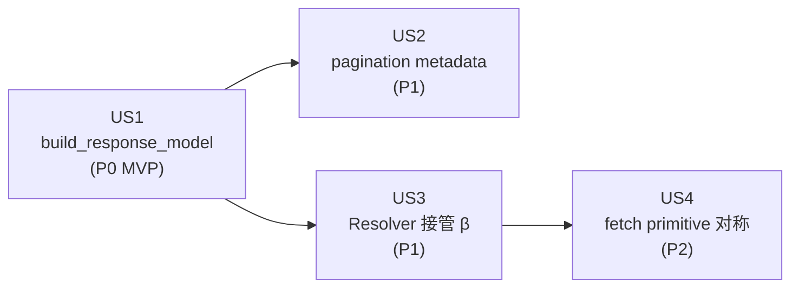

# Tasks: DTO-first gql execution（统一两条 gql 路径）

**Input**: Design documents from `/specs/018-dto-first-gql-execution/`

**Prerequisites**: plan.md ✓, spec.md ✓（含 clarify Session 2026-08-05）, research.md ✓, data-model.md ✓, contracts/dto-first-execution.md ✓, quickstart.md ✓

**Tests**: 本特性以"零回归"为核心 gate（US1 P0），测试任务**必须**包含（非 optional）。

**Organization**: 4 个 Step（US1 P0 / US2 P1 / US3 P1 / US4 P2），按依赖顺序展开。MVP = US1。

## Format: `[ID] [P?] [Story?] Description`

- **[P]**: 可并行（不同文件，无未完成任务依赖）
- **[Story]**: US1/US2/US3/US4
- 描述必须含具体 file path

## Path Conventions

- 源代码：`src/nexusx/`
- 测试：`tests/`
- benchmark：`benchmarks/`（新增目录）

---

## Phase 1: Setup（基础设施）

**Purpose**: feature flag 入口就位，让后续每个 Step 都能通过 flag 控制新旧路径。

- [X] T001 GraphQLHandler.__init__ 加 `use_response_builder: bool = False` 参数，传递给 QueryExecutor，存为 `self._use_response_builder`。**不**改变默认行为（默认 False = 旧路径）。file: src/nexusx/handler.py + src/nexusx/execution/query_executor.py

**Checkpoint**: flag 就位但没人用，全量测试零回归。

---

## Phase 2: Foundational（跨 US 阻塞前置）

无。每个 US 自包含，依赖都在 Phase 1（T001）里。Setup 完成 → 直接进 US1。

---

## Phase 3: User Story 1 — entity-first gql 走 build_response_model（零回归）(Priority: P0) 🎯 MVP

**Goal**: 把 `QueryExecutor._serialize` 替换为 `build_response_model` + model_validate，flag-on / flag-off 输出 diff 为空。

**Independent Test**: 全量 1429 测试在 `use_response_builder=True` / `False` 两个值下跑，响应 dict diff 为空。

### Tests for User Story 1

> 写在 implementation 之前，确保 flag-on 跑这些 case 失败（红），实现后通过（绿）。

- [X] T002 [P] [US1] 写等价性 fixture：`tests/test_query_executor_dto_first.py`。覆盖 (a) scalar + nested 关系，(b) paginated package（`{ Product { by_filter { reviews { items {} pagination {} } } } }`），(c) federation materialized remote type。每个 case 跑 flag-on / flag-off 两次，assert dict 相等。

### Implementation for User Story 1

- [X] T003 [US1] `response_builder._build_paginated_model`：识别 field_tree 含 `items` + `pagination` 子键时构造 `{items: list[nested], pagination: Pagination}` shape，复用 `pagination.create_result_type`（src/nexusx/loader/pagination.py:104）。file: src/nexusx/response_builder.py
- [X] T004 [US1] `response_builder._resolve_forward_reference` 扩展接收 `optional federation_namespace: dict[str, type]`，先搜 federation 物化的 remote type，再搜本地 SQLModel subclasses。file: src/nexusx/response_builder.py
- [X] T005 [US1] `response_builder.serialize_with_model` 加 `federation_namespace` 参数透传；加 paginated package 序列化分支（拼 items + pagination 两层）。file: src/nexusx/response_builder.py
- [X] T006 [US1] `QueryExecutor._serialize_via_response_builder`：新方法，调 `build_response_model` + `serialize_with_model`，传 `federation_namespace=self._registry.fed_namespace`（或等价接口）。file: src/nexusx/execution/query_executor.py
- [X] T007 [US1] `QueryExecutor._serialize` 加 if-else：`self._use_response_builder` 为 True 走新方法，否则走旧 `_serialize_legacy`（重命名当前实现）。失败时直接 raise，**不 fallback**（spec clarify Q3）。file: src/nexusx/execution/query_executor.py
- [X] T008 [US1] 跑全量 1429 测试两次（flag-on / flag-off），用 `pytest --parametrize` 或脚本对比响应 dict，确认 diff 为空。零回归才算 US1 done。

**Checkpoint**: flag-on 行为跟 flag-off 完全一致。US1 可独立交付（即使后续 US 不做，flag 默认 False 也不影响生产）。

---

## Phase 4: User Story 2 — pagination 进 DTO field (Priority: P1)

**Goal**: `reviews(limit: 5)` 在 build_response_model 阶段变成 dynamic model 的 `Annotated[list[X], Paged(limit=5)]`，Resolver 读 metadata 触发 page_loader。

**Independent Test**: 单测 `build_response_model` 对 `reviews(limit: 5)` 输出的字段类型是 `Annotated[list[X], Paged(limit=5)]`；不带 args 的 `reviews` 字段类型是 `list[X]`。

**依赖**: US1 完成（build_response_model 已激活）。

### Tests for User Story 2

- [X] T009 [P] [US2] 写 build_response_model pagination 单测：`tests/test_response_builder_pagination.py`。覆盖 (a) `reviews(limit: 5)` → `Annotated[list[X], Paged(limit=5)]`，(b) 无 args 的 `reviews` → `list[X]`，(c) `reviews(limit: 5, order: HIGHEST_RATING)` → metadata 含 order。

### Implementation for User Story 2

- [X] T010 [US2] `build_response_model` 加 `pagination_metadata: dict[str, Paged] | None = None` 参数（gql args 派生）。file: src/nexusx/response_builder.py
- [X] T011 [US2] `build_response_model` 识别 paginated field_tree + metadata 时，把字段类型从 `list[X]` 升级为 `Annotated[list[X], Paged(...)]`，复用 `pagination.Paged` dataclass。file: src/nexusx/response_builder.py
- [X] T012 [US2] Resolver 加 `_extract_paged_metadata(field_hint)` 工具方法：从 `typing.get_args(hint)[1:]` 找 `Paged` 实例，返回 metadata 或 None。file: src/nexusx/resolver.py
- [X] T013 [US2] Resolver 处理 dynamic model field 时，若 `_extract_paged_metadata` 返回非 None，走 page_loader 链路（用 Paged metadata 构造 PageLoadCommand，跟 specs/015 + γ Paged merge 链路兼容）。file: src/nexusx/resolver.py
- [X] T014 [US2] QueryExecutor 把 gql field arguments（limit/offset/order/direction）派生成 `Paged` 实例，传给 `build_response_model(pagination_metadata=...)`。file: src/nexusx/execution/query_executor.py

**Checkpoint**: pagination 信息从 gql args → dynamic model Annotated → Resolver → page_loader，链路打通。US2 可独立交付（与 US3 互不冲突）。

---

## Phase 5: User Story 3 — Resolver 接管 β federation dispatch (Priority: P1)

**Goal**: `fetch_remote_subtree` 不再被 `QueryExecutor` 直接调用，改由 Resolver 内部触发。

**Independent Test**: `grep -rn "fetch_remote_subtree" src/nexusx/` 命中收敛到只在 Resolver 内部；全量 federation 测试（specs/012/013/014/015/016）零回归。

**依赖**: US1 完成（Resolver 接管后用 dynamic model Annotated metadata 触发 loader）。

### Tests for User Story 3

- [X] T015 [P] [US3] 写 Resolver entity dispatch 单测：`tests/test_resolver_beta_dispatch.py`。覆盖 (a) 本地 rel 走 _get_loader，(b) β remote 走 fetch_remote_subtree，(c) coalesced 字段 skip。

### Implementation for User Story 3

- [X] T016 [US3] 把 `QueryExecutor._bfs_resolve` + `_build_field_jobs` + `_load_field` + `_load_field_batch` + `_load_field_paginated` 整段**搬迁**（不重写）到 Resolver 新方法 `_bfs_dispatch_entity_fields`，签名接收 `(parents, parent_entity, field_sel, response_model)`。file: src/nexusx/resolver.py
- [X] T017 [US3] `QueryExecutor._resolve_result` 改调 `Resolver._bfs_dispatch_entity_fields(...)`，删掉原本的 BFS 实现。file: src/nexusx/execution/query_executor.py
- [X] T018 [US3] 删除 `query_executor.py:456/469` 的 `fetch_remote_subtree` 直接调用（已在 Resolver 内部）。file: src/nexusx/execution/query_executor.py
- [X] T019 [US3] 跑全量 federation 测试（`tests/test_federation_*.py`），确认零回归。这是 US3 的硬 gate。

**Checkpoint**: federation fetch primitive 收敛到 Resolver 内部；executor 退化成 "parse gql + dispatch method + build_response_model + Resolver.resolve"。US3 可独立交付。

---

## Phase 6: User Story 4 — fetch primitive 对称化 (Priority: P2)

**Goal**: `fetch_remote_subtree` docstring 改诚实（β-only）；新增 `fetch_dto_subtree`（γ-only），Resolver γ dispatch 改调它。

**Independent Test**: docstring 校验 + `grep -rn "set_dto_page_params"` 调用方收敛到只在 `fetch_dto_subtree` 内部。

**依赖**: US3 完成（Resolver 是 fetch primitive 的统一 caller）。

### Tests for User Story 4

- [X] T020 [P] [US4] 写 fetch primitive 对称性测试：`tests/test_fetch_primitive_symmetry.py`。覆盖 (a) `fetch_remote_subtree.__doc__` 含 "β entity federation"，(b) `fetch_dto_subtree.__doc__` 含 "γ DTO federation"，(c) grep 验证调用方收敛。

### Implementation for User Story 4

- [X] T021 [US4] `fetch_remote_subtree` docstring 改诚实："β entity federation 专用（entity-first gql 入口）"，去掉"shared primitive for both β and γ"误导。file: src/nexusx/federation/remote_loader.py
- [X] T022 [US4] 新增 `fetch_dto_subtree(*, registry, dto_loader_cls, parents, field_name, page_params=None)`，封装"get_loader + set_dto_page_params + load_many"段。file: src/nexusx/federation/remote_loader.py
- [X] T023 [US4] Resolver γ dispatch（resolver.py:531-538 当前直接 `set_dto_page_params + load_many`）改调 `fetch_dto_subtree`。file: src/nexusx/resolver.py
- [X] T024 [US4] `grep -rn "set_dto_page_params" src/nexusx/` 验证调用方收敛到只在 `fetch_dto_subtree` 内部。

**Checkpoint**: β / γ fetch primitive 对称、docstring 诚实、γ 路径用统一 primitive。018 全部 US 完成。

---

## Phase 7: Polish & Cross-Cutting

**Purpose**: 性能 baseline、flag 切换、删旧路径、文档。

- [X] T025 [P] 写 gql benchmark 脚本：`benchmarks/gql_benchmark.py`。cProfile + latency，跑 representative gql query fixture（scalar / nested / paginated / federation），对比 flag-on vs flag-off。file: benchmarks/gql_benchmark.py
- [X] T026 [P] 跑 benchmark 脚本，记录 baseline 报告：`specs/018-dto-first-gql-execution/benchmark-baseline.md`（新建）。flag-on 回退 > 10% 时分析瓶颈。
- [X] T027 Step 1.c：`use_response_builder` 默认值切 `True`，旧路径加 `# DEPRECATED` 注释；写 changelog + migration guide。file: src/nexusx/handler.py + CHANGELOG
- [X] T028 Step 1.d（US4 完成、benchmark 通过后）：删除 `_serialize_legacy` + 删 `use_response_builder` flag + 删 QueryExecutor if-else 分支。file: src/nexusx/handler.py + src/nexusx/execution/query_executor.py
- [X] T029 [P] 文档更新：CHANGELOG（用户视角）+ migration guide（开发者视角，如何处理 flag 切换）。file: CHANGELOG.md + docs/migration/018-dto-first.md

---

## Dependencies & Execution Order

### Phase 依赖

- **Phase 1 (Setup)**: 无依赖，可立即开始
- **Phase 2 (Foundational)**: 无内容（合并到 Phase 1）
- **Phase 3 (US1, MVP)**: 依赖 T001（flag 就位）
- **Phase 4 (US2)**: 依赖 US1（build_response_model 已激活）
- **Phase 5 (US3)**: 依赖 US1（Resolver 接管后用 dynamic model）
- **Phase 6 (US4)**: 依赖 US3（Resolver 是 fetch primitive 的统一 caller）
- **Phase 7 (Polish)**: T027 依赖 US1+US2+US3+US4 全 done；T028 依赖 T027 + benchmark 通过

### US 依赖图



### 可并行

- **US2 ↔ US3**：都依赖 US1，互不冲突（US2 改 pagination metadata，US3 改 dispatch 路径），可并行
- **Phase 7 的 T025/T026 (benchmark) ↔ T027 (flag 切换)**：benchmark 先跑出 baseline，flag 切换独立

---

## Parallel Example: Phase 4 + Phase 5

如果团队容量允许，US1 完成后：

```bash
# Developer A 走 US2 路径
Task: T009 [P] [US2] pagination 单测
Task: T010-T014 [US2] build_response_model + Resolver 改造

# Developer B 走 US3 路径
Task: T015 [P] [US3] Resolver dispatch 单测
Task: T016-T019 [US3] _bfs_resolve 搬迁 + grep 验证
```

两条路径互不冲突，可并行实施，最后合并跑全量 federation 测试。

---

## Implementation Strategy

### MVP First（仅 US1）

1. T001 Setup flag → T002 写等价性 fixture（红）→ T003-T007 实现响应构建 → T008 全量回归（绿）
2. **STOP and VALIDATE**: flag-on 行为跟 flag-off 完全一致
3. 不切默认值（保留 `use_response_builder=False`），US1 作为 opt-in 交付

### Incremental Delivery

1. **US1（MVP）**: build_response_model 激活，flag-on 零回归 → opt-in 验证
2. **US2**: pagination 进 DTO field → metadata 链路打通
3. **US3**: Resolver 接管 β → fetch primitive 收敛
4. **US4**: γ 对称 → fetch_remote_subtree / fetch_dto_subtree 形态对称
5. **Phase 7**: flag 默认 True → 删旧路径 → 文档发布

每个 US 独立可交付，互不阻塞（除 US4 必须 US3 先）。

---

## Notes

- 每个 US 完成后跑全量 1429 测试 + 对应的 Independent Test，才算 done
- T008（US1 全量回归）/ T019（US3 federation 全量回归）是硬 gate
- 失败处理：build_response_model 出错直接 raise（spec clarify Q3），不 fallback
- pagination metadata 在 dynamic model 上注入，不在 entity 类加声明（spec clarify Q4）
- benchmark 是 opt-in 验证（不在 CI 每次 commit 跑），仅 Step 1/3 完成后跑一次（spec clarify Q2）
