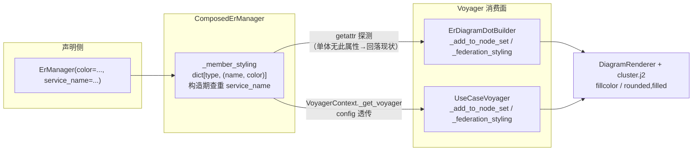

# Data Model — 022 Voyager Composed 分组与配色

本特性无持久化数据。核心数据结构是一个**运行期只读映射**及其两个消费视图。

## 1. member 分组映射（新增）

ComposedErManager 暴露的聚合视图（property `_member_styling`）：

```python
# key: 实体类（来自 member 的 entities）或 DTO 类（来自 member 的 dto_classes）
# value: (service_name, color) —— 该 member 的名字与 opt-in 颜色
_member_styling: dict[type, tuple[str, str | None]]
```

构造规则：

| 来源 member | 实体 | dto_classes 中的 DTO |
|---|---|---|
| 设了 `service_name` | 进映射 → `(service_name, color)` | 进映射 → `(service_name, color)` |
| 未设 `service_name` | **不进**（回落 Python module 分组） | **不进** |
| 设了 `color` 但未设 `service_name` | **不进**（color 依赖 service_name 生效，静默忽略不报错） | 同左 |

派生约束：

- **service_name 唯一性**（FR-009）：构造期对设了 `service_name` 的 member 集合查重，重名 `ValueError`。错误信息须列出冲突名字。
- 映射**不可变**（019 FR-016 同款纪律）：构造后成员固定，映射惰性构建一次并缓存。

## 2. ErManager 的新字段

```python
ErManager.__init__(..., color: str | None = None)
# 存为 self._voyager_color；单体场景不消费（research Unknown 4）
```

无校验（research：颜色值透传 graphviz）。

## 3. 消费视图一：SchemaNode.module（改写规则）

节点归属 = cluster 归属。改写优先级（FR-003/FR-005，两个消费面一致）：

```text
fed_qn 命中（federation 物化类型）   → module = 远端 service 名      （现状，不动）
_member_styling 命中（member 实体/DTO）→ module = service_name        （新增）
其他（未命名 member 的实体 / 未注册 DTO / Route 节点）→ module = Python __module__（现状，不动）
```

## 4. 消费视图二：module_color / federated_modules（合并规则）

`_federation_styling()`（ER 图与 UseCase 页各自的实现）扩展为三元合并：

```text
module_color = { **member_colors, **fed_colors, **user_module_color }
               （user 显式 module_color 仍最高优先，现状语义保持）
federated_modules = 远端 service 名集合（不变；member 名不进 dashed 集合）
```

member cluster 样式恒为 `rounded`（有 color 时 `rounded,filled`）；远端 federation cluster 保持 dashed（FR-006）。

## 5. 实体关系图


