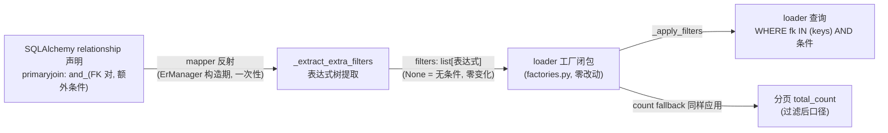

# Data Model: 025 FK 关系条件过滤

**日期**: 2026-09-30

## 总览

本特性**不引入任何持久化实体**（无新表、无新列、无迁移）。数据面的全部变化是**内存结构的一条既有通道被激活**：relationship 声明的额外条件 → 提取为 SQLAlchemy 表达式列表 → 经 loader 工厂的既有 `filters` 参数进入查询。



## 内存结构变化

### RelationshipInfo（既存结构，无字段新增）

提取结果**不落** `RelationshipInfo` 字段——条件表达式列表在 `_inspect_relationships` 内提取后直接传给工厂闭包捕获，对下游（Resolver/序列化/schema 渲染）完全不可见。这与条件的本质一致：它是查询语义，不是关系元数据（FR-008 schema 形态不变的实现落点）。

### filters 通道（既存，本特性首次使用）

5 个 loader 工厂（M2O / O2M / M2M / 分页 O2M / 分页 M2M）签名中的 `filters: list[Any] | None`：`None` = 无条件（存量路径，零变化）；非空 = 提取条件，经 `_apply_filters` 追加到主查询与分页计数兜底查询。

## 提取规则（形式化）

输入：`rel.primaryjoin`（M2M 另查 `rel.secondaryjoin`，见下）、FK 对签名集 `P`（由 `local_remote_pairs` / `secondary_synchronize_pairs` 构造的双向四元组集合）。

```
extract(join_expr):
  对 join_expr 顶层按 and_ 拆分为子句 c₁..cₙ:
    cᵢ 为 [列 L] == [列 R] 且 (L,R) 签名 ∈ P      → 跳过（FK 等值对）
    cᵢ 为 [列] <比较> [常量]                       → 收集为独立条件
    cᵢ 为 or_ / not_ 布尔组合                      → 整体收集为单一条件
    cᵢ 为其他（双列非 FK 对、函数、子查询）         → ValueError（不支持形态）
  校验全部收集条件引用的列 ∈ 合法表集合:
    O2M / M2O / O2M_SCALAR: {target.__table__}
    M2M: {target.__table__, secondary}
  M2M 额外: primaryjoin 侧存在额外条件 → ValueError（引用 source 列,不可执行）
```

**关键不变量**：`or_` 组合不得拆散（拆散即 AND 语义破坏——实验证实）；校验用 Table 对象身份比较（非名字比较）。

## 生命周期 / 状态转换

无。条件为**静态声明**：提取发生在 ErManager 构造期（关系扫描现场），一次提取、全程不变；不支持运行时变更（Assumptions 明确）。

## 验证规则（来自 spec FR）

| 规则 | 失败行为 |
|------|----------|
| 条件引用列必须在合法表集合内 | ErManager 构造时 `ValueError`（含实体名/关系名/列名） |
| M2M primaryjoin 侧出现额外条件 | 同上 |
| 双列比较且非 FK 对 | 同上 |
| 函数表达式 / 子查询参与条件 | 同上 |
| 无条件 / 纯 FK 关系 | 不触发任何新逻辑（`extract` 返回 None） |
